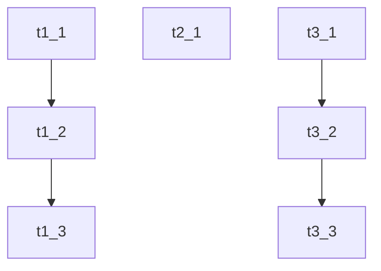
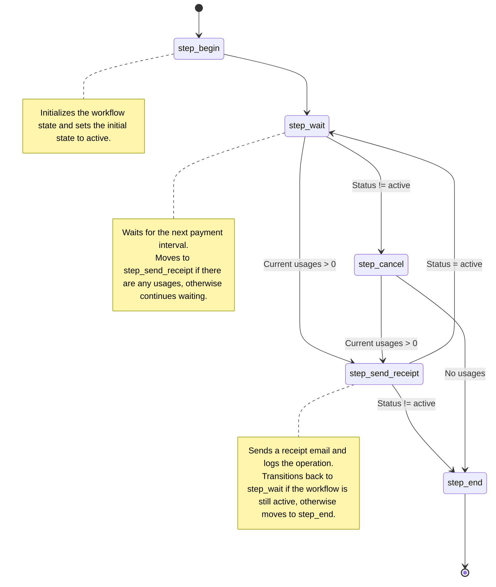

================================================
FILE: README.md
================================================
# tiny-workflow

## Overview

**tiny-workflow** is heavily inspired by [Temporal](https://temporal.io/), but it aims to provide a simpler, more portable solution that only requires basic components to run.

### Key Features

- **Code-Driven**: Workflows can be executed, paused, and resumed multiple times.
  - Logic is defined in a single TypeScript class with multiple steps.
  - **State-Centric**: The state can be modified by step logic or external actions (see [doc/example_intervalPayment.md](doc/example_intervalPayment.md)).
- **Data Persistence**: Workflow data is stored as JSON, which can be saved in any database.
- **TypeScript-Based**: Written entirely in TypeScript.

### Workflow Structure

A workflow consists of steps, state data, and logs:

- **Steps**: Workflows can be broken down into multiple steps.
  - Steps can be revisited.
  - Steps may contain multiple actions.
    - Results are cached to prevent re-execution on resume.
    - Automatically retries on failure.
- **Lifecycle**: A workflow progresses through different states:
  - **Create** -> **Run** (using a generator that yields) -> **Pause** when awaiting a specific condition.
    - **Events**: Waiting for user input, triggers, etc.
    - **Timers**: Resume after a specified duration.

### Basic Helper

- **Runtime**: Manages the creation and execution of multiple workflows (see in /examples/flows ).

## Basic Example

Here's a simple computed workflow [examples/simple.ts](examples/flows/simple.ts)

```typescript
enum EStep {
  step_begin = "step_begin",
  step_compute = "step_compute",
  step_end = "step_end",
}

type TStateShape = Partial<{
  startHit: boolean;
  computed: number;
  endHit: boolean;
}>;

// Additional audit log messages
type EAuditLog = "start_hit" | "end_hit" | "computed_hit";

class SampleState extends DurableState<EStep, TStateShape, EAuditLog> {
  constructor() {
    super(EStep.step_begin, {
      withAuditLog: true,
    });

    // Register all step handlers
    Object.values(EStep).forEach((step) =>
      this.stepHandler.set(step, this[step].bind(this))
    );
  }

  private async *step_begin(): StepIt<EStep, EStep.step_compute> {
    this.state.startHit = true;
    this.addLog({
      type: "start_hit",
      values: {},
    });
    return { nextStep: EStep.step_compute };
  }

  private async *step_compute(): StepIt<EStep, EStep.step_end> {
    // Cached action to prevent re-evaluation when the step resumes
    const { it, value } = await this.withAction("cache_computed", async () => {
      return Math.PI;
    });
    if (it) yield it;

    this.addLog({
      type: "computed_hit",
      values: { actionValue: value },
    });
    this.state.computed = value;

    return { nextStep: EStep.step_end };
  }

  private async *step_end(): StepIt<EStep, null> {
    this.state.endHit = true;
    this.addLog({
      type: "end_hit",
      values: {},
    });
    return { nextStep: null };
  }
}
```

To run this workflow:

```ts
let ins = new SampleState();

console.log("begin");
// 1st run
{
  const tmp = ins.exec();
  await tmp.next();
  console.log(
    " ",
    "currentStep=",
    ins.currentStep,
    ",currentState=",
    ins.currentState
  );

  // terminate run
  await tmp.return(null);
}

console.log("---------- SAVE/LOAD ---------");
// save to json
const savedWorkflowData = ins.toJSON();
// load from json
ins = SampleState.fromJSON(SampleState, savedWorkflowData);

// resume and run till end
{
  const tmp = ins.exec();
  for await (const it of ins.exec()) {}
  console.log(
    " ",
    "currentStep=",
    ins.currentStep,
    ",currentState=",
    ins.currentState
  );
}

console.log("end");
console.log("finalWorkflowData:", ins.toJSON());
```

Console output:

```sh
>bun examples/flows/simple.ts
begin
[DurableState][1i6h2retd][step_begin] start
	 ... do heavy computed ...
  currentStep= step_compute ,currentState= {
  startHit: true,
}
[DurableState][1i6h2retd][step_compute] end
---------- SAVE/LOAD ---------
[DurableState][1i6h2retj][step_compute] start
[DurableState][1i6h2retj][step_end] end
  currentStep= step_end ,currentState= {
  startHit: true,
  computed: 3.141592653589793,
  endHit: true,
}
end
finalWorkflowData: {
  step: "step_end",
  state: {
    startHit: true,
    computed: 3.141592653589793,
    endHit: true,
  },
  cache: {
    _seq: 2,
    "1:step_compute:cache_computed": 3.141592653589793,
  },
  system: {},
  logs: [
    #  omit
  ],
}
```

## More examples:

- [Guess My Number Game](examples/flows/guessGame_2.ts) -  Play the "Guess My Number" game in the terminal.

```sh
> bun run examples/flows/guessGame_2.ts

🤟 Wellcome to GuessGame_2 🤟
[DurableState][1i6h4ac2q][step_begin] start
number between 0-100. Empty for simulate save/load: [] 50
value 50 is < than the answer - number between 0-100: []
----- saved -----
[DurableState][1i6h4ac2q][step_ask] end
🤟 Wellcome to GuessGame_2 🤟
----- resumed -----
[DurableState][1i6h4afb2][step_ask] start
value 50 is < than the answer - number between 0-100: [] 75
value 75 is > than the answer - number between 0-100: []
----- saved -----
[DurableState][1i6h4afb2][step_ask] end
🤟 Wellcome to GuessGame_2 🤟
----- resumed -----
[DurableState][1i6h4ap6b][step_ask] start
value 75 is > than the answer - number between 0-100: [] 60
value 60 is < than the answer - number between 0-100: [] 80
value 80 is > than the answer - number between 0-100: [] 73
You need 5 rounds to guess the number 73. Congratulation!: []
[DurableState][1i6h4ap6b][step_end] end
```

- [User Onboarding email](examples/flows/userOnboarding.ts) -  Manage multiple asynchronous workflows (one workflow per user).

```sh
> bun run examples/flows/userOnboarding.ts
 [ 🔒 ] - r_0
 [ 🔒 ] - r_1
[DurableState][r_0][step_begin] start
[DurableState][r_1][step_begin] start
[DurableState][r_0][step_process] Send wellcome email to email_0@abc.com, deliveryId=m.uca8etk1cs
[DurableState][r_1][step_process] Send wellcome email to email_1@abc.com, deliveryId=n.38ddch8ric
[DurableState][r_0][step_process] Wait for 692ms
[DurableState][r_1][step_process] Wait for 4244ms
[DurableState][r_0][step_process] end
[DurableState][r_1][step_process] end
 [ 🗝️ ] - r_0
 [ 🗝️ ] - r_1
 [ 🔒 ] - r_0
[DurableState][r_0][step_process] start
[DurableState][r_0][step_process] Send promotion email to email_0@abc.com, deliveryId=mh.buious91k
[DurableState][r_0][step_process] Wait for 1434ms
[DurableState][r_0][step_process] end
 [ 🗝️ ] - r_0
 [ 🔒 ] - r_0
[DurableState][r_0][step_process] start
[DurableState][r_0][step_end] end
 [ 🗝️ ] - r_0
 [ 🔒 ] - r_1
[DurableState][r_1][step_process] start
[DurableState][r_1][step_process] Send promotion email to email_1@abc.com, deliveryId=45f.62q3im0g
[DurableState][r_1][step_process] Wait for 690ms
[DurableState][r_1][step_process] end
 [ 🗝️ ] - r_1
 [ 🔒 ] - r_1
[DurableState][r_1][step_process] start
[DurableState][r_1][step_end] end
 [ 🗝️ ] - r_1
all done!
```
- [DAG Task](examples/flows/dagTask.ts) - Simulate sequence tasks with dependencies.



```sh
> bun run examples/flows/dagTask.ts

------------------------
Run only 2 iter
------------------------
start task  t1_1
start task  t2_1
start task  t3_1
         take a break. poll again after 500 ms
pool task  t1_1 -> processing
pool task  t2_1 -> processing
pool task  t3_1 -> processing
------------------------
SIMULATE SAVE / LOAD
Resume after 5 sec
------------------------
pool task  t1_1 -> end
pool task  t2_1 -> end
pool task  t3_1 -> end
start task  t1_2
start task  t3_2
         take a break. poll again after 500 ms
pool task  t1_2 -> end
pool task  t3_2 -> end
start task  t1_3
         take a break. poll again after 500 ms
pool task  t1_3 -> end
         take a break. poll again after 500 ms
allDone: true
```


## Development

To install dependencies:

```bash
bun install
```

To test:

```bash
bun test
```

Examples:

```bash
bun run examples/guessGame.ts
```

To build node compatible:

```bash
bun run build:npm
```

## TODO

- web component to display worflow
  - steps transition, state base on auditLog

## Research Topics

- TS AST step transition parse

  - check [bun ast discuss](https://github.com/oven-sh/bun/discussions/3763)
  - play at `r_d/test_type_scan.ts`


================================================
FILE: package.json
================================================
{
  "name": "tiny-workflow",
  "workspaces": [
    "packages/*"
  ],
  "devDependencies": {
    "bun-plugin-dts": "^0.2.3"
  },
  "scripts": {
    "build:npm:all": "bun run --filter 'tiny-workflow*' build:npm"
  }
}


================================================
FILE: tsconfig.json
================================================
{
  "exclude": ["node_modules", "dist"],
  "compilerOptions": {
    // Enable latest features
    "lib": ["ESNext", "DOM"],
    "target": "ESNext",
    "module": "ESNext",
    "moduleDetection": "force",
    "jsx": "react-jsx",
    "allowJs": true,

    // Bundler mode
    "moduleResolution": "bundler",
    "allowImportingTsExtensions": true,
    "verbatimModuleSyntax": true,
    "noEmit": true,

    // Best practices
    "strict": true,
    "skipLibCheck": true,
    "noFallthroughCasesInSwitch": true,

    // Some stricter flags (disabled by default)
    "noUnusedLocals": false,
    "noUnusedParameters": false,
    "noPropertyAccessFromIndexSignature": false
  }
}


================================================
FILE: doc/example_intervalPayment.md
================================================
# Subscription payment with Tiny Workflow

This guide will help you get started with the **tiny-workflow** package by walking you through setting up and running an example workflow.

## Prerequisites

Ensure you have the following tools installed:
- [Bun](https://bun.sh/)

## Installation

First, clone the repository and install the dependencies:

```bash
git clone https://github.com/your-username/tiny-workflow.git
cd tiny-workflow
bun install
```

## Targets

For this quick start, we will use the `intervalPayment` example which demonstrates a subscription workflow:

- Collect the usage, create a receipt, and send email for cycles.
- Workflow (per customer) can be create, run, resumed, and persisted as JSON.

## Understanding the Code

The `intervalPayment.ts` script defines a workflow class `IntervalPaymentFlow` which extends `DurableState` with the following generic types:

```ts
class IntervalPaymentFlow extends DurableState<EStep, TStateShape, EAuditLog> {...}
```

### Enumerations and Types

```ts
enum EStep {
  step_begin = "step_begin",
  step_wait = "step_wait",
  step_send_receipt = "step_send_receipt",
  step_cancel = "step_cancel",
  step_end = "step_end",
}

type UsageItem = {
  item: string;
  amount: number;
};

type ReceiptItem = {
  cycle: number;
  createdAt: number;
  usages: UsageItem[];
  deliveryId?: string;
};

// Defines the shape of the workflow state
type TStateShape = {
  // User email address for sending receipts
  userEmail: string;

  // Interval in milliseconds for each payment cycle
  paymentIntervalMs: number;

  // Internal variable to keep track of the current cycle number
  _cycle: number;

  // Timestamp for the next payment cycle
  _nextPaymentAt: number;

  // Subscription status to determine if the workflow is active or cancelled
  status: "active" | "cancel";

  // List of current usage items for the ongoing cycle
  currentUsages: UsageItem[];

  // List of all receipts generated through different cycles
  receipts: Array<ReceiptItem>;
};


type EAuditLog = "set_param" | "add_usage" | "bill_sent" | "cancel";
```

### Workflow Steps

- **step_begin**: Initializes the state and moves to `step_wait`.

- **step_wait**: Waits for the next payment interval. If there are usages, creates a receipt and moves to `step_send_receipt`. If canceled, moves to `step_cancel`.

- **step_send_receipt**: Sends a receipt email, logs the operation, and moves back to `step_wait` if active, otherwise to `step_end`.

- **step_cancel**: Cancels the workflow and sends any remaining receipts. Moves to `step_end`.

- **step_end**: Ends the workflow.


### Actions

The `IntervalPaymentFlow` class includes two primary actions: `actionAddUsage` and `actionCancel`.

#### actionAddUsage

Adds a usage item to the current cycle. It ensures the workflow is active before adding the item to the `currentUsages` array and logs the action.

```ts
actionAddUsage(usageItem: UsageItem) {
  if (this.state.status != "active")
    throw new Error("status is not active. can not process");

  this.state.currentUsages.push({ ...usageItem });
  this.addLog({
    type: "add_usage",
    values: {
      ...usageItem,
    },
  });
}
```

#### actionCancel

Cancels the current workflow by setting its status to "cancel" and logs the action. This is typically invoked when the user chooses to end their subscription.

```ts
actionCancel() {
  if (this.state.status != "active")
    throw new Error("status is not active. can not process");

  this.state.status = "cancel";

  this.addLog({
    type: "cancel",
    values: {},
  });
}
```

### Context and Runtime

A `MemContext` class extends `SimpleContext` for managing the workflow instances and persistence. The `WorkflowRuntime` class is used to manage and execute workflow instances.

## Running the Example

Run the following command to start the `intervalPayment` workflow:

Output

```bash
bun run examples/flows/intervalPayment.ts
 [ 🔒 ] - run_info@company.com
[DurableState][run_info@company.com][step_begin] start
[DurableState][run_info@company.com][step_wait] wait for cycle_no= 0
[DurableState][run_info@company.com][step_wait] end
 [ 🗝️ ] - run_info@company.com
🤟 Wellcome info@company.com to IntervalPayment 🤟

  /state:         print state as json
  /add [num]:     add a random usage. default num=1
  /save:          save storage to file
  /cancel:        cancel
  /exit:          exit

/add 3
 [ 🔒 ] - run_info@company.com
add usage id_19 - 1
add usage id_42 - 9
add usage id_90 - 10
 [ 🗝️ ] - run_info@company.com
 [ 🔒 ] - run_info@company.com
[DurableState][run_info@company.com][step_wait] start
[DurableState][run_info@company.com][step_wait] inc cycle_no= 1 nextCheck= 1723991753520
[DurableState][run_info@company.com][step_send_receipt] Send bill for cycle_no=0 to email=info@company.com, receipt={"cycle":0,"createdAt":1723991743520,"usages":[{"item":"id_19","amount":1},{"item":"id_42","amount":9},{"item":"id_90","amount":10}]}
[DurableState][run_info@company.com][step_wait] wait for cycle_no= 1
[DurableState][run_info@company.com][step_wait] end
 [ 🗝️ ] - run_info@company.com
/state
{
  step: "step_wait",
  state: {
    userEmail: "info@company.com",
    paymentIntervalMs: 10000,
    status: "active",
    _cycle: 1,
    _nextPaymentAt: 1723991753520,
    currentUsages: [],
    receipts: [
      [Object ...]
    ],
  },
  runtimeUsage: {
    total: 4,
    done: 0,
  },
}
/cancel
 [ 🔒 ] - run_info@company.com
canceled
 [ 🗝️ ] - run_info@company.com
 [ 🔒 ] - run_info@company.com
[DurableState][run_info@company.com][step_wait] start
[DurableState][run_info@company.com][step_end] end
 [ 🗝️ ] - run_info@company.com
all done
db synced:  intervalPayment_db.json
```

Happy coding!


================================================
FILE: examples/flows/dagTask.ts
================================================
import { DurableState, type StepIt } from "tiny-workflow-core/src";
import { setTimeout } from "node:timers/promises";
import assert from "node:assert";

enum EStep {
  step_begin = "step_begin",
  step_process = "step_process",
  step_end = "step_end",
}

export type TaskInfo<T = Record<string, any>, IDType = string> = {
  id: IDType;
  status?: "waiting" | "processing" | "end";
  ctx?: T;
};

export type TaskSequence<T = any, IDType = string> = TaskInfo<T, IDType>[];

export type TStateShape = Partial<{
  sequences: TaskSequence[];
}>;

// additional audit log message
type EAuditLog = "start_hit" | "end_hit";

export type TaskDagHandler<D = any, K = string> = {
  doStart: (itm: TaskInfo<D, K>) => Promise<void>;
  pollStatus: (itm: TaskInfo<D, K>) => Promise<TaskInfo["status"]>;
};

class DagTaskEngine extends DurableState<EStep, TStateShape, EAuditLog> {
  constructor(private logicHandler: TaskDagHandler) {
    super(EStep.step_begin, {
      withAuditLog: false,
      debug: false,
    });

    // collect and resgister all step handler
    Object.values(EStep).map((step) =>
      this.stepHandler.set(step, this[step].bind(this))
    );
  }

  updateLogicHandler(logicHandler: TaskDagHandler) {
    this.logicHandler = logicHandler;
  }

  setState(state: TStateShape) {
    this.state = state;
  }

  override exec(runId?: string) {
    if (!this.logicHandler) throw new Error("missing logicHandler");

    return super.exec();
  }

  private async *step_begin(): StepIt<EStep, EStep.step_process> {
    return { nextStep: EStep.step_process };
  }

  private async *step_process(): StepIt<
    EStep,
    EStep.step_end | EStep.step_process
  > {
    const sequences = this.state.sequences ?? [];

    const tasks = sequences.map((chain) => this._processOneChain(chain));

    while (!this.allDone) {
      const res = await Promise.allSettled(tasks.map((itm) => itm.next()));
      const errors = res.filter((itm) => itm.status === "rejected");
      if (errors.length !== 0) {
        throw new Error(
          `Got errors: ${JSON.stringify(
            errors.map((err) => {
              return {
                message: err?.reason?.message,
                stackTrace: err?.reason?.stack,
              };
            })
          )}`
        );
      }

      yield {
        canContinue: false,
        activeStep: EStep.step_process,
      };
    }

    return { nextStep: EStep.step_end };
  }

  private async *step_end(): StepIt<EStep, null> {
    return { nextStep: null };
  }

  private async *_processOneChain(chain: TaskInfo[]) {
    for (let i = 0; i < chain.length; i++) {
      const itm = chain[i];
      if (itm.status === "end") continue;

      const isWaiting = itm.status === "waiting" || itm.status === undefined;
      if (isWaiting) {
        await this.logicHandler.doStart(itm);
        itm.status = "processing";
        itm.ctx = itm.ctx || {};
        itm.ctx.startTime = Date.now();
        this.addLog({
          type: "start_hit",
          values: {
            id: itm.id,
          },
        });
      }

      // poll
      if (itm.status === "processing") {
        const nextStatus = await this.logicHandler.pollStatus(itm);
        itm.status = nextStatus;
        if (nextStatus === "end") {
          itm.ctx = itm.ctx || {};
          itm.ctx.endTime = Date.now();
          this.addLog({
            type: "end_hit",
            values: {
              id: itm.id,
            },
          });
          continue;
        }
      }

      yield;
      i--;
    }
  }

  public get allDone() {
    const sequences = this.state.sequences ?? [];
    return sequences.every(this.isOneChainDone);
  }

  private isOneChainDone(chain: TaskInfo[]) {
    return chain.every((itm) => itm.status === "end");
  }
}

//------------------------------
//  Helper
//------------------------------

function buildSequence<T = any, K = string>() {
  const sequence: TaskSequence<T, K> = [];
  const ins = {
    build() {
      return sequence;
    },
    isEmpty() {
      return sequence.length === 0;
    },
    next(taskInfo: TaskInfo<T, K>) {
      sequence.push(taskInfo);
      return ins;
    },
  };
  return ins;
}

function generateGraphviz(ins: DagTaskEngine) {
  const sequences = ins.currentState.sequences ?? [];
  const logs = ins.auditLogs;

  let graph = 'digraph G {\n  rankdir="LR";\n';

  sequences.forEach((sequence, index) => {
    sequence.forEach((task, i) => {
      if (i < sequence.length - 1) {
        graph += `  "${task.id}" -> "${sequence[i + 1].id}";\n`;
      }
    });
  });

  logs.forEach((log) => {
    const task = sequences.flat().find((t) => t.id === log.values.id);
    const startTime = task?.ctx?.startTime
      ? new Date(task.ctx.startTime).toISOString()
      : "N/A";
    const endTime = task?.ctx?.endTime
      ? new Date(task.ctx.endTime).toISOString()
      : "N/A";

    if (log.type === "start_hit") {
      graph += `  "${log.values.id}" [label="${log.values.id}", shape=box, style=filled, color=lightblue];\n`;
    }
  });

  graph += "}\n";

  console.log(graph);
}

function generateTimelineLog(ins: DagTaskEngine) {
  const logs = ins.auditLogs;
  let timelineLog = "Task Timeline:\n";

  const groupedLogs = logs
    .filter((itm) => ["start_hit", "end_hit"].includes(itm.type))
    .sort((a, b) => Number(a._at) - Number(b._at))
    .reduce((acc, log) => {
      if (!acc[log.values.id]) {
        acc[log.values.id] = {};
      }
      acc[log.values.id][log.type as EAuditLog] = log._at;
      return acc;
    }, {} as Record<string, { start_hit?: number; end_hit?: number }>);

  Object.entries(groupedLogs).forEach(([id, times]) => {
    const startTime = times.start_hit
      ? new Date(times.start_hit).toISOString()
      : "N/A";
    const endTime = times.end_hit
      ? new Date(times.end_hit).toISOString()
      : "N/A";
    const duration =
      times.start_hit && times.end_hit
        ? `${(times.end_hit - times.start_hit) / 1000} seconds`
        : "N/A";

    timelineLog += `Task ID: ${id}\n`;
    timelineLog += `  Start Time: ${startTime}\n`;
    timelineLog += `  End Time: ${endTime}\n`;
    timelineLog += `  Duration: ${duration}\n`;
  });

  console.log(timelineLog);
}

async function main() {
  /*
    Simulate sequence task

    t1_1 -> t1_2 -> t1_3
    t2_1
    t3_1 -> t3_2 -> t3_3

    Should finish when all tasks done
  */
  const taskState: TStateShape = {
    sequences: [
      // c1
      buildSequence()
        .next({
          id: "t1_1",
          ctx: {
            _doneAt: Date.now() + 1000,
          },
        })
        .next({
          id: "t1_2",
          ctx: {
            _doneAt: Date.now() + 2000,
          },
        })
        .next({
          id: "t1_3",
          ctx: {
            _doneAt: Date.now() + 3000,
          },
        })
        .build(),

      // c2
      buildSequence()
        .next({
          id: "t2_1",
          ctx: {
            _doneAt: Date.now() + 2000,
          },
        })
        .build(),
      // c3
      buildSequence()
        .next({
          id: "t3_1",
          ctx: {
            _doneAt: Date.now() + 1000,
          },
        })
        .next({
          id: "t3_2",
          ctx: {
            _doneAt: Date.now() + 5000,
          },
        })
        .build(),
    ],
  };

  // simulate pool workflow
  const handler: TaskDagHandler = {
    doStart: async (itm: TaskInfo) => {
      // do nothing
      console.info("start task ", itm.id);
    },
    pollStatus: async (itm: TaskInfo) => {
      const _doneAt = itm.ctx?.["_doneAt"] ?? 0;
      let status: TaskInfo["status"] = "processing";
      if (Date.now() > _doneAt) {
        status = "end";
      }

      console.info("pool task ", itm.id, "->", status);
      return status;
    },
  };

  async function _runMaxIter(ins: DagTaskEngine, maxIter: number) {
    for await (const it of ins.exec()) {
      maxIter--;
      if (maxIter <= 0) return false;

      const breakTime = 500;
      console.log(`\t take a break. poll again after ${breakTime} ms`);
      // console.dir(ins.currentState.sequences, { depth: 10 });
      await setTimeout(breakTime);
    }
    return true;
  }

  let ins: DagTaskEngine;
  let data;

  // 1st run. only 2 iter
  console.log("------------------------");
  console.log("Run only 2 iter");
  console.log("------------------------");

  {
    ins = new DagTaskEngine(handler);
    ins.setState(taskState);
    await _runMaxIter(ins, 2);
    data = ins.toJSON();
  }

  console.log("------------------------");
  console.log("SIMULATE SAVE / LOAD");
  console.log("Resume after 5 sec");
  console.log("------------------------");

  await setTimeout(5000);

  // load and resume
  {
    ins = DagTaskEngine.fromJSON(DagTaskEngine, data);
    ins.updateLogicHandler(handler);

    const res = await _runMaxIter(ins, 1000);

    assert(res === true, "Something wrong");
  }

  console.log("allDone:", ins.allDone);
  console.dir(ins.toJSON(), { depth: 10 });

  console.log("Generating Graphviz digraph...");
  generateGraphviz(ins);
  generateTimelineLog(ins);
}

main();


================================================
FILE: examples/flows/guessGame.ts
================================================
import { join } from "path";
import {
  DurableState,
  type EventSystemEntry,
  type StepHandler,
  type StepIt,
} from "tiny-workflow-core/src";

enum EStep {
  step_begin = "step_begin",
  step_play = "step_play",
  step_end = "step_end",
}
type TStateShape = {
  number: number;
  answer?: number[];
};
type EAuditLog = "log";

class GuessGameState extends DurableState<EStep, TStateShape, EAuditLog> {
  // Type Safeguard & Auto register
  private _static(key: EStep): StepHandler<EStep> {
    return this[key];
  }
  private _collectAndRegisterSteps() {
    Object.values(EStep).map((step) =>
      this.stepHandler.set(step, this._static(step).bind(this))
    );
  }
  constructor() {
    super(EStep.step_begin, {
      withAuditLog: false,
      debug: true,
    });
    this._collectAndRegisterSteps();
  }

  private async *step_begin(): StepIt<EStep, EStep.step_play> {
    const res = await this.withAction("generate_num", async () => {
      return Math.round(Math.random() * 100);
    });
    if (res.it) yield res.it;
    this.state.number = res.value;
    return { nextStep: EStep.step_play };
  }

  private async *step_play(): StepIt<EStep, EStep.step_end> {
    let count = 0;
    let question = `number between 0-100. Empty for simulate save/load`;
    let answer = [];
    const guessNum = this.state.number;
    while (true) {
      const tmp = this.waitForEvent(`event_ask_${count++}`, {
        question: `${question}`,
      });
      if (tmp.it) yield tmp.it;
      const last_answer = tmp.value();
      answer.push(last_answer);

      if (last_answer === guessNum) {
        break;
      } else if (last_answer < guessNum) {
        question = `value ${last_answer} is < than the answer - number between 0-100`;
      } else {
        question = `value ${last_answer} is > than the answer - number between 0-100`;
      }
    }
    this.state.answer = answer;

    return { nextStep: EStep.step_end };
  }

  private async *step_end(): StepIt<EStep, null> {
    const tmp = this.waitForEvent(`event_congratulation`, {
      question: `You need ${this.state.answer?.length} rounds to guess the number ${this.state.number}. Congratulation!`,
    });
    if (tmp.it) yield tmp.it;

    return { nextStep: null };
  }
}

async function main() {
  let state = null;
  while (true) {
    state = await run(state);
    if (!state) return;
  }
}
main();

async function run(state?: any): Promise<Object | null> {
  let ins!: GuessGameState;
  if (!state) ins = new GuessGameState();
  else {
    console.log("----- resumed -----");
    ins = GuessGameState.fromJSON(GuessGameState, state, {
      withAuditLog: false,
      debug: true,
    });
  }
  for await (const it of ins.exec()) {
    if (it.resumeTrigger) {
      const resumeId = it.resumeTrigger.resumeId;
      const resumeEntry = ins.getResume(resumeId) as EventSystemEntry;
      const ans = prompt(`${resumeEntry.requestPayload.question}:`, "");
      // ignore on end
      if (it.activeStep === EStep.step_end) {
        break;
      }

      if (ans) {
        ins.resolveResume(resumeId, parseInt(ans as string));
      } else {
        console.log("----- saved -----");
        return ins.toJSON();
      }
    }
  }

  Bun.write(
    join(__dirname, "./tmp/state.json"),
    JSON.stringify(ins.toJSON(), null, " ")
  );
  return null;
}


================================================
FILE: examples/flows/guessGame_2.ts
================================================
import { join } from "path";
import {
  DurableState,
  type EventSystemEntry,
  type StepHandler,
  type StepIt,
} from "tiny-workflow-core/src";

enum EStep {
  step_begin = "step_begin",
  step_ask = "step_ask",
  step_check = "step_check",
  step_end = "step_end",
}
type TStateShape = {
  number: number;
  hint: string;
  answer?: number[];
};
type EAuditLog = "log";

class GuessGame2State extends DurableState<EStep, TStateShape, EAuditLog> {
  // Type Safeguard & Auto register
  private _static(key: EStep): StepHandler<EStep> {
    return this[key];
  }
  private _collectAndRegisterSteps() {
    Object.values(EStep).map((step) =>
      this.stepHandler.set(step, this._static(step).bind(this))
    );
  }
  constructor() {
    super(EStep.step_begin, {
      withAuditLog: true,
      debug: true,
    });
    this._collectAndRegisterSteps();
  }

  private async *step_begin(): StepIt<EStep, EStep.step_ask> {
    const res = await this.withAction("generate_num", async () => {
      return Math.round(Math.random() * 100);
    });
    if (res.it) yield res.it;
    this.state.number = res.value;
    this.state.hint = `number between 0-100. Empty for simulate save/load`;
    return { nextStep: EStep.step_ask };
  }

  private async *step_ask(): StepIt<EStep, EStep.step_check> {
    let answer = this.state.answer ?? [];
    const hint = this.state.hint;
    const tmp = this.waitForEvent(`event_ask`, {
      question: hint,
    });
    if (tmp.it) yield tmp.it;
    const last_answer = tmp.value();
    answer.push(last_answer);
    this.state.answer = answer;

    return { nextStep: EStep.step_check };
  }

  private async *step_check(): StepIt<EStep, EStep.step_end | EStep.step_ask> {
    const guessNum = this.state.number;
    const last_answer = this.state.answer?.at(-1);
    if (!last_answer) throw new Error("OoO last_answer should not null");

    if (last_answer === guessNum) {
      return { nextStep: EStep.step_end };
    } else if (last_answer < guessNum) {
      this.state.hint = `value ${last_answer} is < than the answer - number between 0-100`;
    } else {
      this.state.hint = `value ${last_answer} is > than the answer - number between 0-100`;
    }
    return { nextStep: EStep.step_ask };
  }

  private async *step_end(): StepIt<EStep, null> {
    const tmp = this.waitForEvent(`event_congratulation`, {
      question: `You need ${this.state.answer?.length} rounds to guess the number ${this.state.number}. Congratulation!`,
    });
    if (tmp.it) yield tmp.it;

    return { nextStep: null };
  }
}

type SnapshotType = ReturnType<GuessGame2State["toJSON"]>;

async function main() {
  let state: SnapshotType | null = null;
  while (true) {
    state = await run(state);
    if (!state) return;
  }
}
main();

async function run(state?: SnapshotType | null): Promise<SnapshotType | null> {
  console.log("🤟 Wellcome to GuessGame_2 🤟");

  let ins!: GuessGame2State;
  if (!state) ins = new GuessGame2State();
  else {
    console.log("----- resumed -----");
    ins = GuessGame2State.fromJSON(GuessGame2State, state, {
      withAuditLog: false,
      debug: true,
    });
  }
  for await (const it of ins.exec()) {
    if (it.resumeTrigger) {
      const resumeId = it.resumeTrigger.resumeId;
      const resumeEntry = ins.getResume(resumeId) as EventSystemEntry;
      const ans = prompt(`${resumeEntry.requestPayload.question}:`, "");
      // ignore on end
      if (it.activeStep === EStep.step_end) {
        break;
      }

      if (ans) {
        ins.resolveResume(resumeId, parseInt(ans as string));
      } else {
        console.log("----- saved -----");
        return ins.toJSON();
      }
    }
  }

  Bun.write(
    join(__dirname, "./tmp/state_2.json"),
    JSON.stringify(ins.toJSON(), null, " ")
  );
  return null;
}


================================================
FILE: examples/flows/intervalPayment.ts
================================================
import { join } from "path";
import {
  DurableState,
  SimpleContext,
  WorkflowRuntime,
  type StepHandler,
  type StepIt,
  type WorkflowRuntimeOpt,
} from "tiny-workflow-core/src";

enum EStep {
  step_begin = "step_begin",
  step_wait = "step_wait",
  step_send_receipt = "step_send_receipt",
  step_cancel = "step_cancel",
  step_end = "step_end",
}

type UsageItem = {
  item: string;
  amount: number;
};
type ReceiptItem = {
  cycle: number;
  createdAt: number;
  usages: UsageItem[];
  deliveryId?: string;
};
type TStateShape = {
  userEmail: string;
  paymentIntervalMs: number;

  _cycle: number;
  _nextPaymentAt: number;

  status: "active" | "cancel";
  currentUsages: UsageItem[];

  receipts: Array<ReceiptItem>;
};
type EAuditLog = "set_param" | "add_usage" | "bill_sent" | "cancel";

class IntervalPaymentFlow extends DurableState<EStep, TStateShape, EAuditLog> {
  // Type Safeguard & Auto register
  private _static(key: EStep): StepHandler<EStep> {
    return this[key];
  }
  private _collectAndRegisterSteps() {
    Object.values(EStep).map((step) =>
      this.stepHandler.set(step, this._static(step).bind(this))
    );
  }
  constructor() {
    super(EStep.step_begin, {
      withAuditLog: false,
      debug: true,
    });
    this._collectAndRegisterSteps();
  }

  setParam(tmp: Pick<TStateShape, "userEmail" | "paymentIntervalMs">) {
    this.state = { ...this.state, ...tmp };
    this.addLog({
      type: "set_param",
      values: {
        ...tmp,
      },
    });
  }

  actionAddUsage(usageItem: UsageItem) {
    if (this.state.status != "active")
      throw new Error("status is not active. can not process");

    this.state.currentUsages.push({ ...usageItem });
    this.addLog({
      type: "add_usage",
      values: {
        ...usageItem,
      },
    });
  }

  actionCancel() {
    if (this.state.status != "active")
      throw new Error("status is not active. can not process");

    this.state.status = "cancel";

    this.addLog({
      type: "cancel",
      values: {},
    });
  }

  private async *step_begin(): StepIt<EStep, EStep.step_wait> {
    this.state = {
      ...this.state,
      ...{
        status: "active",
        _cycle: 0,
        _nextPaymentAt: Date.now() + this.state.paymentIntervalMs,
        currentUsages: [],
        receipts: [],
      },
    };
    return { nextStep: EStep.step_wait };
  }

  private async *step_wait(): StepIt<
    EStep,
    EStep.step_cancel | EStep.step_send_receipt
  > {
    while (this.state.status === "active") {
      const cycle_no = this.state._cycle;
      const needToWaitMs = this.state._nextPaymentAt - Date.now();
      const res = this.waitForMs(
        `wait_for_end_cycle_${cycle_no}`,
        needToWaitMs
      );
      if (res.it) {
        this._debug("wait for cycle_no=", cycle_no);
        yield res.it;
      }

      if (this.state.status !== "active") {
        return { nextStep: EStep.step_cancel };
      }

      this.state._cycle = this.state._cycle + 1;
      this.state._nextPaymentAt = Date.now() + this.state.paymentIntervalMs;
      this._debug(
        "inc cycle_no=",
        this.state._cycle,
        "nextCheck=",
        this.state._nextPaymentAt
      );

      // have any usage
      if (this.state.currentUsages.length > 0) {
        const receipt: ReceiptItem = {
          cycle: cycle_no,
          createdAt: Date.now(),
          usages: [...this.state.currentUsages],
        };
        this.state.receipts.push(receipt);
        this.state.currentUsages = [];

        return { nextStep: EStep.step_send_receipt };
      }
    }

    return { nextStep: EStep.step_cancel };
  }

  private async *step_send_receipt(): StepIt<
    EStep,
    EStep.step_wait | EStep.step_end
  > {
    const lastReceipt = this.state.receipts.at(-1);
    const cycle_no = lastReceipt?.cycle;
    if (!lastReceipt) throw new Error("lastReceipt is null");

    const res = await this.withAction<string>(
      `send_receipt_email_${cycle_no}`,
      async () => {
        const deliveryId = Date.now().toString(32);
        this._debug(
          `Send bill for cycle_no=${cycle_no} to email=${
            this.state.userEmail
          }, receipt=${JSON.stringify(lastReceipt)}`
        );

        this.addLog({
          type: "bill_sent",
          values: {
            receipt: { ...lastReceipt },
          },
        });
        return deliveryId;
      }
    );

    if (res.it) {
      yield res.it;
    }
    if (res.value) lastReceipt.deliveryId = res.value;

    if (this.state.status === "active") return { nextStep: EStep.step_wait };
    else return { nextStep: EStep.step_end };
  }

  private async *step_cancel(): StepIt<
    EStep,
    EStep.step_end | EStep.step_send_receipt
  > {
    const cycle_no = this.state._cycle;

    // any usage ?
    if (this.state.currentUsages.length > 0) {
      const receipt: ReceiptItem = {
        cycle: cycle_no,
        createdAt: Date.now(),
        usages: [...this.state.currentUsages],
      };
      this.state.receipts.push(receipt);
      this.state.currentUsages = [];

      return { nextStep: EStep.step_send_receipt };
    }

    return { nextStep: EStep.step_end };
  }

  private async *step_end(): StepIt<EStep, null> {
    return { nextStep: null };
  }
}

class MemContext<T extends DurableState> extends SimpleContext<T> {
  async lock(runId: string) {
    await super.lock(runId);
    console.info("\x1b[34m", `[ 🔒 ] - ${runId}`, "\x1b[0m");
  }

  async unlock(runId: string) {
    await super.unlock(runId);
    console.info("\x1b[34m", `[ 🗝️ ] - ${runId}`, "\x1b[0m");
  }

  async shutdown() {
    await super.shutdown();
    await this.syncDBToFile();
  }

  async syncDBToFile() {
    const savePath = join(__dirname, "./tmp/intervalPayment_db.json");
    Bun.write(savePath, JSON.stringify([...this.db.entries()], null, " "));
    console.log("db synced: ", savePath);
  }
}

async function main() {
  const ctx = new MemContext<IntervalPaymentFlow>();
  let count = 0;
  const opt: WorkflowRuntimeOpt<IntervalPaymentFlow> = {
    ctx,
    genRunId: async () => `r_${count++}`,
    InstanceClass: IntervalPaymentFlow,
  };
  new WorkflowRuntime<IntervalPaymentFlow>(opt);
  await ctx.start();

  const ins = new IntervalPaymentFlow();
  ins.setParam({
    userEmail: "info@company.com",
    paymentIntervalMs: 10_000,
  });

  // Unique runId per user
  const runId = `run_${ins.currentState.userEmail}`;

  // Workflow run on server side
  await ctx.runner.addTask(runBackground(runId, ctx, ins), {
    runId,
  });

  // User terminal interface
  ctx.runner.addTask(runFrontend(runId, ctx), {
    runId,
  });

  await ctx.runner.idle();
  console.log("all done");

  await ctx.shutdown();
}
main();

async function runBackground(
  runId: string,
  ctx: MemContext<IntervalPaymentFlow>,
  ins: IntervalPaymentFlow
) {
  let tmp = await ctx.runtime.run(ins, runId);
  ctx.runner.addTask(ctx.scheduleNextRun(runId, tmp), {
    runId,
  });
  return runId;
}

async function runFrontend(
  runId: string,
  ctx: MemContext<IntervalPaymentFlow>
) {
  const usage = `
  /state:         print state as json
  /add [num]:     add a random usage. default num=1
  /save:          save storage to file
  /cancel:        cancel
  /exit:          exit
  `;
  console.log(`🤟 Wellcome ${"info@company.com"} to IntervalPayment 🤟`);
  console.log(usage);

  type cmdType = "/state" | "/add" | "/save" | "/exit" | "/cancel";

  for await (const line of console) {
    const tmp = line.trim().split(" ");
    const cmd = tmp[0] as cmdType;
    const args = tmp.slice(1);

    switch (cmd) {
      case "/state":
        {
          const ins = await ctx.runtime.createInstanceByRunId(
            runId,
            IntervalPaymentFlow
          );
          console.log({
            step: ins.currentStep,
            state: ins.currentState,
            runtimeUsage: ctx.runner.stats(),
          });
        }
        continue;
      case "/add": {
        {
          const sample = parseInt(args[0] ?? "1");

          ctx.withTransaction(runId, async () => {
            const ins = await ctx.runtime.createInstanceByRunId(
              runId,
              IntervalPaymentFlow
            );
            for (let i = 0; i < sample; i++) {
              const item = `id_${Math.round(Math.random() * 100)}`;
              const amount = Math.round(Math.random() * 10);
              ins.actionAddUsage({
                item,
                amount,
              });
              console.log(`add usage ${item} - ${amount}`);
            }
          });
        }
        continue;
      }

      case "/save":
        {
          ctx.syncDBToFile();
          console.log("saved");
        }
        continue;

      case "/cancel":
        {
          ctx.withTransaction(runId, async () => {
            const ins = await ctx.runtime.createInstanceByRunId(
              runId,
              IntervalPaymentFlow
            );
            ins.actionCancel();
            console.log("canceled");
          });
        }
        return;

      case "/exit":
        console.log("exit!");
        process.exit(0);

      default:
        console.log(usage);
    }
  }
}


================================================
FILE: examples/flows/simple.ts
================================================
import { DurableState, type StepIt } from "tiny-workflow-core/src";

enum EStep {
  step_begin = "step_begin",
  step_compute = "step_compute",
  step_end = "step_end",
}
type TStateShape = Partial<{
  startHit: boolean;
  computed: number;
  endHit: boolean;
}>;

// additional audit log message
type EAuditLog = "start_hit" | "end_hit" | "computed_hit";

class SampleState extends DurableState<EStep, TStateShape, EAuditLog> {
  constructor() {
    super(EStep.step_begin, {
      withAuditLog: true,
      debug: true,
    });

    // collect and resgister all step handler
    Object.values(EStep).map((step) =>
      this.stepHandler.set(step, this[step].bind(this))
    );
  }

  private async *step_begin(): StepIt<EStep, EStep.step_compute> {
    this.state.startHit = true;
    this.addLog({
      type: "start_hit",
      values: {},
    });
    return { nextStep: EStep.step_compute };
  }

  private async *step_compute(): StepIt<EStep, EStep.step_end> {
    // with cached action with cache key 'cache_computed'
    // it prevent the action evalulate when step resume
    const { it, value } = await this.withAction("cache_computed", async () => {
      console.log("\t ... do heavy computed ... ");
      return Math.PI;
    });
    if (it) yield it;

    this.addLog({
      type: "computed_hit",
      values: {
        actionValue: value,
      },
    });
    this.state.computed = value;

    return { nextStep: EStep.step_end };
  }
  private async *step_end(): StepIt<EStep, null> {
    this.state.endHit = true;
    this.addLog({
      type: "end_hit",
      values: {},
    });
    return { nextStep: null };
  }
}

async function main() {
  let ins = new SampleState();

  console.log("begin");
  // 1st run
  {
    const tmp = ins.exec();
    await tmp.next();
    console.log(
      " ",
      "currentStep=",
      ins.currentStep,
      ",currentState=",
      ins.currentState
    );

    // terminate run
    await tmp.return(null);
  }

  console.log("---------- SAVE/LOAD ---------");
  // save to json
  const savedWorkflowData = ins.toJSON();
  // load from json
  ins = SampleState.fromJSON(SampleState, savedWorkflowData);

  {
    for await (const it of ins.exec()) {
    }
    console.log(
      " ",
      "currentStep=",
      ins.currentStep,
      ",currentState=",
      ins.currentState
    );
  }

  console.log("end");
  console.log("finalWorkflowData:", ins.toJSON());
}
main();


================================================
FILE: examples/flows/userOnboarding.ts
================================================
import { join } from "path";
import {
  DurableState,
  SimpleContext,
  WorkflowRuntime,
  type StepHandler,
  type StepIt,
  type WorkflowRunResult,
  type WorkflowRuntimeOpt,
} from "tiny-workflow-core/src";

enum EStep {
  step_begin = "step_begin",
  step_process = "step_process",
  step_end = "step_end",
}
type TStateShape = {
  userEmail: string;
  waitBeforePromotionEmail: number;
  waitBeforeEnd: number;
};
type EAuditLog = "email_sent" | "email_updated";

class UserOnboardingFlow extends DurableState<EStep, TStateShape, EAuditLog> {
  // Type Safeguard & Auto register
  private _static(key: EStep): StepHandler<EStep> {
    return this[key];
  }
  private _collectAndRegisterSteps() {
    Object.values(EStep).map((step) =>
      this.stepHandler.set(step, this._static(step).bind(this))
    );
  }
  constructor() {
    super(EStep.step_begin, {
      withAuditLog: true,
      debug: true,
    });
    this._collectAndRegisterSteps();
  }

  setEmail(email: string) {
    this.addLog({
      type: "email_updated",
      values: {
        oldValue: this.state.userEmail,
        newValue: email,
      },
    });
    this.state.userEmail = email;
  }

  private async *step_begin(): StepIt<EStep, EStep.step_process> {
    return { nextStep: EStep.step_process };
  }

  private async *step_process(): StepIt<EStep, EStep.step_end> {
    // Send wellcome email
    {
      const res = await this.withAction("send_email_wellcome", async () => {
        const deliveryId = performance.now().toString(32);

        this._debug(
          `Send wellcome email to ${this.state.userEmail}, deliveryId=${deliveryId}`
        );
        this.addLog({ type: "email_sent", values: { deliveryId } });
        this.state.waitBeforePromotionEmail = Math.round(Math.random() * 5000);

        return deliveryId;
      });
      if (res.it) yield res.it;
    }

    {
      // waiting for x sec -> send promotion email
      const waitRes = this.waitForMs(
        "wait_before_promotion_email",
        this.state.waitBeforePromotionEmail
      );
      if (waitRes.it) {
        this._debug(`Wait for ${this.state.waitBeforePromotionEmail}ms`);
        yield waitRes.it;
      }
    }

    {
      const res = await this.withAction("send_email_promotion", async () => {
        const deliveryId = performance.now().toString(32);

        this._debug(
          `Send promotion email to ${this.state.userEmail}, deliveryId=${deliveryId}`
        );
        this.addLog({ type: "email_sent", values: { deliveryId } });
        this.state.waitBeforeEnd = Math.round(Math.random() * 2000);

        return deliveryId;
      });
      if (res.it) yield res.it;
    }

    {
      // waiting for x sec -> end
      const waitRes = this.waitForMs(
        "wait_before_end",
        this.state.waitBeforeEnd
      );
      if (waitRes.it) {
        this._debug(`Wait for ${this.state.waitBeforeEnd}ms`);
        yield waitRes.it;
      }
    }

    return { nextStep: EStep.step_end };
  }

  private async *step_end(): StepIt<EStep, null> {
    return { nextStep: null };
  }
}

class MemContext extends SimpleContext<UserOnboardingFlow> {
  async lock(runId: string) {
    await super.lock(runId);
    console.info("\x1b[34m", `[ 🔒 ] - ${runId}`, "\x1b[0m");
  }

  async unlock(runId: string) {
    await super.unlock(runId);
    console.info("\x1b[34m", `[ 🗝️ ] - ${runId}`, "\x1b[0m");
  }

  async syncDBToFile() {
    const savePath = join(__dirname, "./tmp/userOnboarding_db.json");
    Bun.write(savePath, JSON.stringify([...this.db.entries()], null, " "));
  }
}

async function main() {
  const ctx = new MemContext();
  let count = 0;
  const opt: WorkflowRuntimeOpt<UserOnboardingFlow> = {
    genRunId: async () => `r_${count++}`,
    ctx,
    InstanceClass: UserOnboardingFlow,
  };
  const workflowRuntime = new WorkflowRuntime<UserOnboardingFlow>(opt);
  ctx.runner.reset();

  const job = async (email: string) => {
    let tmp = await workflowRuntime.run(createWork(email));
    if (tmp.status === "error") {
      console.error(`error runId=${tmp.runId} - detail=`, tmp);
      return;
    }
    await ctx.scheduleNextRun(tmp.runId, tmp);
  };

  for (let i = 0; i < 10; i++) {
    ctx.runner.addTask(job(`email_${i}@abc.com`));
  }

  await ctx.runner.idle();
  console.log("all done!");
  await ctx.syncDBToFile();
}

main();

function createWork(email: string) {
  const ins = new UserOnboardingFlow();
  ins.setEmail(email);
  return ins;
}


================================================
FILE: examples/flows/tmp/intervalPayment_db.json
================================================
[
 [
  "run_info@company.com",
  {
   "step": "step_end",
   "state": {
    "userEmail": "info@company.com",
    "paymentIntervalMs": 10000,
    "status": "cancel",
    "_cycle": 1,
    "_nextPaymentAt": 1723991753520,
    "currentUsages": [],
    "receipts": [
     {
      "cycle": 0,
      "createdAt": 1723991743520,
      "usages": [
       {
        "item": "id_19",
        "amount": 1
       },
       {
        "item": "id_42",
        "amount": 9
       },
       {
        "item": "id_90",
        "amount": 10
       }
      ],
      "deliveryId": "1i5iukn11"
     }
    ]
   },
   "cache": {
    "_seq": 5,
    "2:step_send_receipt:send_receipt_email_0": "1i5iukn11"
   },
   "system": {
    "1:step_wait:timer:wait_for_end_cycle_0": {
     "type": "timer",
     "isDone": true,
     "resumeId": "wait_for_end_cycle_0-1i5iukd8c",
     "resumeAfter": 1723991743515
    },
    "3:step_wait:timer:wait_for_end_cycle_1": {
     "type": "timer",
     "isDone": true,
     "resumeId": "wait_for_end_cycle_1-1i5iukn12",
     "resumeAfter": 1723991753520
    }
   },
   "logs": [
    {
     "type": "set_param",
     "values": {
      "userEmail": "info@company.com",
      "paymentIntervalMs": 10000
     },
     "_at": 1723991733508,
     "_step": "step_begin"
    },
    {
     "type": "add_usage",
     "values": {
      "item": "id_19",
      "amount": 1
     },
     "_at": 1723991736996,
     "_step": "step_wait"
    },
    {
     "type": "add_usage",
     "values": {
      "item": "id_42",
      "amount": 9
     },
     "_at": 1723991736996,
     "_step": "step_wait"
    },
    {
     "type": "add_usage",
     "values": {
      "item": "id_90",
      "amount": 10
     },
     "_at": 1723991736996,
     "_step": "step_wait"
    },
    {
     "type": "bill_sent",
     "values": {
      "receipt": {
       "cycle": 0,
       "createdAt": 1723991743520,
       "usages": [
        {
         "item": "id_19",
         "amount": 1
        },
        {
         "item": "id_42",
         "amount": 9
        },
        {
         "item": "id_90",
         "amount": 10
        }
       ]
      }
     },
     "_at": 1723991743522,
     "_step": "step_send_receipt"
    },
    {
     "type": "cancel",
     "values": {},
     "_at": 1723991751502,
     "_step": "step_wait"
    }
   ]
  }
 ]
]


================================================
FILE: examples/flows/tmp/state.json
================================================
{
 "step": "step_end",
 "state": {
  "number": 8,
  "answer": [
   50,
   25,
   15,
   10,
   5,
   8
  ]
 },
 "cache": {
  "0:step_begin:generate_num": 8,
  "_seq": 2
 },
 "system": {
  "1:step_play:event:event_ask_0": {
   "type": "event",
   "isDone": true,
   "resumeId": "event_ask_0-1i4bg506v",
   "requestPayload": {
    "question": "number between 0-100. Empty for simulate save/load"
   },
   "responsePayload": 50
  },
  "1:step_play:event:event_ask_1": {
   "type": "event",
   "isDone": true,
   "resumeId": "event_ask_1-1i4bg52de",
   "requestPayload": {
    "question": "value 50 is > than the answer - number between 0-100"
   },
   "responsePayload": 25
  },
  "1:step_play:event:event_ask_2": {
   "type": "event",
   "isDone": true,
   "resumeId": "event_ask_2-1i4bg578s",
   "requestPayload": {
    "question": "value 25 is > than the answer - number between 0-100"
   },
   "responsePayload": 15
  },
  "1:step_play:event:event_ask_3": {
   "type": "event",
   "isDone": true,
   "resumeId": "event_ask_3-1i4bg5bhl",
   "requestPayload": {
    "question": "value 15 is > than the answer - number between 0-100"
   },
   "responsePayload": 10
  },
  "1:step_play:event:event_ask_4": {
   "type": "event",
   "isDone": true,
   "resumeId": "event_ask_4-1i4bg5eer",
   "requestPayload": {
    "question": "value 10 is > than the answer - number between 0-100"
   },
   "responsePayload": 5
  },
  "1:step_play:event:event_ask_5": {
   "type": "event",
   "isDone": true,
   "resumeId": "event_ask_5-1i4bg5g6h",
   "requestPayload": {
    "question": "value 5 is < than the answer - number between 0-100"
   },
   "responsePayload": 8
  },
  "2:step_end:event:event_congratulation": {
   "type": "event",
   "isDone": false,
   "resumeId": "event_congratulation-1i4bg5heb",
   "requestPayload": {
    "question": "You need 6 rounds to guess the number 8. Congratulation!"
   },
   "responsePayload": null
  }
 },
 "logs": []
}


================================================
FILE: examples/flows/tmp/state_2.json
================================================
{
 "step": "step_end",
 "state": {
  "number": 62,
  "hint": "value 63 is > than the answer - number between 0-100",
  "answer": [
   50,
   75,
   60,
   55,
   52,
   57,
   59,
   60,
   65,
   63,
   62
  ]
 },
 "cache": {
  "0:step_begin:generate_num": 62,
  "_seq": 23
 },
 "system": {
  "1:step_ask:event:event_ask": {
   "type": "event",
   "isDone": true,
   "resumeId": "event_ask-1i5a54def",
   "requestPayload": {
    "question": "number between 0-100. Empty for simulate save/load"
   },
   "responsePayload": 50
  },
  "3:step_ask:event:event_ask": {
   "type": "event",
   "isDone": true,
   "resumeId": "event_ask-1i5a54l3c",
   "requestPayload": {
    "question": "value 50 is < than the answer - number between 0-100"
   },
   "responsePayload": 75
  },
  "5:step_ask:event:event_ask": {
   "type": "event",
   "isDone": true,
   "resumeId": "event_ask-1i5a54u48",
   "requestPayload": {
    "question": "value 75 is > than the answer - number between 0-100"
   },
   "responsePayload": 60
  },
  "7:step_ask:event:event_ask": {
   "type": "event",
   "isDone": true,
   "resumeId": "event_ask-1i5a550m3",
   "requestPayload": {
    "question": "value 60 is < than the answer - number between 0-100"
   },
   "responsePayload": 55
  },
  "9:step_ask:event:event_ask": {
   "type": "event",
   "isDone": true,
   "resumeId": "event_ask-1i5a5549k",
   "requestPayload": {
    "question": "value 55 is < than the answer - number between 0-100"
   },
   "responsePayload": 52
  },
  "11:step_ask:event:event_ask": {
   "type": "event",
   "isDone": true,
   "resumeId": "event_ask-1i5a556md",
   "requestPayload": {
    "question": "value 52 is < than the answer - number between 0-100"
   },
   "responsePayload": 57
  },
  "13:step_ask:event:event_ask": {
   "type": "event",
   "isDone": true,
   "resumeId": "event_ask-1i5a55ep8",
   "requestPayload": {
    "question": "value 57 is < than the answer - number between 0-100"
   },
   "responsePayload": 59
  },
  "15:step_ask:event:event_ask": {
   "type": "event",
   "isDone": true,
   "resumeId": "event_ask-1i5a55hnt",
   "requestPayload": {
    "question": "value 59 is < than the answer - number between 0-100"
   },
   "responsePayload": 60
  },
  "17:step_ask:event:event_ask": {
   "type": "event",
   "isDone": true,
   "resumeId": "event_ask-1i5a55lhe",
   "requestPayload": {
    "question": "value 60 is < than the answer - number between 0-100"
   },
   "responsePayload": 65
  },
  "19:step_ask:event:event_ask": {
   "type": "event",
   "isDone": true,
   "resumeId": "event_ask-1i5a55of4",
   "requestPayload": {
    "question": "value 65 is > than the answer - number between 0-100"
   },
   "responsePayload": 63
  },
  "21:step_ask:event:event_ask": {
   "type": "event",
   "isDone": true,
   "resumeId": "event_ask-1i5a55qhp",
   "requestPayload": {
    "question": "value 63 is > than the answer - number between 0-100"
   },
   "responsePayload": 62
  },
  "23:step_end:event:event_congratulation": {
   "type": "event",
   "isDone": false,
   "resumeId": "event_congratulation-1i5a55sa5",
   "requestPayload": {
    "question": "You need 11 rounds to guess the number 62. Congratulation!"
   },
   "responsePayload": null
  }
 },
 "logs": [
  {
   "type": "init",
   "values": {
    "defaultStep": "step_begin"
   },
   "_at": 1723696559565,
   "_step": "step_begin"
  },
  {
   "type": "cache",
   "values": {
    "key": "0:step_begin:generate_num"
   },
   "_at": 1723696559566,
   "_step": "step_begin"
  },
  {
   "type": "transition",
   "values": {
    "from": "step_begin",
    "to": "step_ask",
    "stepSeq": 1
   },
   "_at": 1723696559567,
   "_step": "step_ask"
  },
  {
   "type": "interrupt_begin",
   "values": {
    "type": "event",
    "resumeId": "event_ask-1i5a54def"
   },
   "_at": 1723696559567,
   "_step": "step_ask"
  },
  {
   "type": "interrupt_end",
   "values": {
    "resumeId": "event_ask-1i5a54def"
   },
   "_at": 1723696566726,
   "_step": "step_ask"
  },
  {
   "type": "transition",
   "values": {
    "from": "step_ask",
    "to": "step_check",
    "stepSeq": 2
   },
   "_at": 1723696566727,
   "_step": "step_check"
  },
  {
   "type": "transition",
   "values": {
    "from": "step_check",
    "to": "step_ask",
    "stepSeq": 3
   },
   "_at": 1723696566727,
   "_step": "step_ask"
  },
  {
   "type": "interrupt_begin",
   "values": {
    "type": "event",
    "resumeId": "event_ask-1i5a54ke8"
   },
   "_at": 1723696566728,
   "_step": "step_ask"
  },
  {
   "type": "interrupt_begin",
   "values": {
    "type": "event",
    "resumeId": "event_ask-1i5a54l3c"
   },
   "_at": 1723696567404,
   "_step": "step_ask"
  },
  {
   "type": "interrupt_end",
   "values": {
    "resumeId": "event_ask-1i5a54l3c"
   },
   "_at": 1723696575635,
   "_step": "step_ask"
  },
  {
   "type": "transition",
   "values": {
    "from": "step_ask",
    "to": "step_check",
    "stepSeq": 4
   },
   "_at": 1723696575635,
   "_step": "step_check"
  },
  {
   "type": "transition",
   "values": {
    "from": "step_check",
    "to": "step_ask",
    "stepSeq": 5
   },
   "_at": 1723696575635,
   "_step": "step_ask"
  },
  {
   "type": "interrupt_begin",
   "values": {
    "type": "event",
    "resumeId": "event_ask-1i5a54t4j"
   },
   "_at": 1723696575635,
   "_step": "step_ask"
  },
  {
   "type": "interrupt_begin",
   "values": {
    "type": "event",
    "resumeId": "event_ask-1i5a54u48"
   },
   "_at": 1723696576648,
   "_step": "step_ask"
  },
  {
   "type": "interrupt_end",
   "values": {
    "resumeId": "event_ask-1i5a54u48"
   },
   "_at": 1723696578464,
   "_step": "step_ask"
  },
  {
   "type": "transition",
   "values": {
    "from": "step_ask",
    "to": "step_check",
    "stepSeq": 6
   },
   "_at": 1723696578465,
   "_step": "step_check"
  },
  {
   "type": "transition",
   "values": {
    "from": "step_check",
    "to": "step_ask",
    "stepSeq": 7
   },
   "_at": 1723696578465,
   "_step": "step_ask"
  },
  {
   "type": "interrupt_begin",
   "values": {
    "type": "event",
    "resumeId": "event_ask-1i5a54vt1"
   },
   "_at": 1723696578465,
   "_step": "step_ask"
  },
  {
   "type": "interrupt_begin",
   "values": {
    "type": "event",
    "resumeId": "event_ask-1i5a550m3"
   },
   "_at": 1723696579267,
   "_step": "step_ask"
  },
  {
   "type": "interrupt_end",
   "values": {
    "resumeId": "event_ask-1i5a550m3"
   },
   "_at": 1723696582070,
   "_step": "step_ask"
  },
  {
   "type": "transition",
   "values": {
    "from": "step_ask",
    "to": "step_check",
    "stepSeq": 8
   },
   "_at": 1723696582070,
   "_step": "step_check"
  },
  {
   "type": "transition",
   "values": {
    "from": "step_check",
    "to": "step_ask",
    "stepSeq": 9
   },
   "_at": 1723696582070,
   "_step": "step_ask"
  },
  {
   "type": "interrupt_begin",
   "values": {
    "type": "event",
    "resumeId": "event_ask-1i5a553dm"
   },
   "_at": 1723696582070,
   "_step": "step_ask"
  },
  {
   "type": "interrupt_begin",
   "values": {
    "type": "event",
    "resumeId": "event_ask-1i5a5549k"
   },
   "_at": 1723696582964,
   "_step": "step_ask"
  },
  {
   "type": "interrupt_end",
   "values": {
    "resumeId": "event_ask-1i5a5549k"
   },
   "_at": 1723696584759,
   "_step": "step_ask"
  },
  {
   "type": "transition",
   "values": {
    "from": "step_ask",
    "to": "step_check",
    "stepSeq": 10
   },
   "_at": 1723696584759,
   "_step": "step_check"
  },
  {
   "type": "transition",
   "values": {
    "from": "step_check",
    "to": "step_ask",
    "stepSeq": 11
   },
   "_at": 1723696584759,
   "_step": "step_ask"
  },
  {
   "type": "interrupt_begin",
   "values": {
    "type": "event",
    "resumeId": "event_ask-1i5a5561o"
   },
   "_at": 1723696584760,
   "_step": "step_ask"
  },
  {
   "type": "interrupt_begin",
   "values": {
    "type": "event",
    "resumeId": "event_ask-1i5a556md"
   },
   "_at": 1723696585421,
   "_step": "step_ask"
  },
  {
   "type": "interrupt_end",
   "values": {
    "resumeId": "event_ask-1i5a556md"
   },
   "_at": 1723696592748,
   "_step": "step_ask"
  },
  {
   "type": "transition",
   "values": {
    "from": "step_ask",
    "to": "step_check",
    "stepSeq": 12
   },
   "_at": 1723696592748,
   "_step": "step_check"
  },
  {
   "type": "transition",
   "values": {
    "from": "step_check",
    "to": "step_ask",
    "stepSeq": 13
   },
   "_at": 1723696592748,
   "_step": "step_ask"
  },
  {
   "type": "interrupt_begin",
   "values": {
    "type": "event",
    "resumeId": "event_ask-1i5a55drc"
   },
   "_at": 1723696592748,
   "_step": "step_ask"
  },
  {
   "type": "interrupt_begin",
   "values": {
    "type": "event",
    "resumeId": "event_ask-1i5a55ep8"
   },
   "_at": 1723696593704,
   "_step": "step_ask"
  },
  {
   "type": "interrupt_end",
   "values": {
    "resumeId": "event_ask-1i5a55ep8"
   },
   "_at": 1723696596168,
   "_step": "step_ask"
  },
  {
   "type": "transition",
   "values": {
    "from": "step_ask",
    "to": "step_check",
    "stepSeq": 14
   },
   "_at": 1723696596168,
   "_step": "step_check"
  },
  {
   "type": "transition",
   "values": {
    "from": "step_check",
    "to": "step_ask",
    "stepSeq": 15
   },
   "_at": 1723696596168,
   "_step": "step_ask"
  },
  {
   "type": "interrupt_begin",
   "values": {
    "type": "event",
    "resumeId": "event_ask-1i5a55h68"
   },
   "_at": 1723696596168,
   "_step": "step_ask"
  },
  {
   "type": "interrupt_begin",
   "values": {
    "type": "event",
    "resumeId": "event_ask-1i5a55hnt"
   },
   "_at": 1723696596734,
   "_step": "step_ask"
  },
  {
   "type": "interrupt_end",
   "values": {
    "resumeId": "event_ask-1i5a55hnt"
   },
   "_at": 1723696599621,
   "_step": "step_ask"
  },
  {
   "type": "transition",
   "values": {
    "from": "step_ask",
    "to": "step_check",
    "stepSeq": 16
   },
   "_at": 1723696599621,
   "_step": "step_check"
  },
  {
   "type": "transition",
   "values": {
    "from": "step_check",
    "to": "step_ask",
    "stepSeq": 17
   },
   "_at": 1723696599621,
   "_step": "step_ask"
  },
  {
   "type": "interrupt_begin",
   "values": {
    "type": "event",
    "resumeId": "event_ask-1i5a55ki5"
   },
   "_at": 1723696599621,
   "_step": "step_ask"
  },
  {
   "type": "interrupt_begin",
   "values": {
    "type": "event",
    "resumeId": "event_ask-1i5a55l38"
   },
   "_at": 1723696600168,
   "_step": "step_ask"
  },
  {
   "type": "interrupt_begin",
   "values": {
    "type": "event",
    "resumeId": "event_ask-1i5a55lhe"
   },
   "_at": 1723696600622,
   "_step": "step_ask"
  },
  {
   "type": "interrupt_end",
   "values": {
    "resumeId": "event_ask-1i5a55lhe"
   },
   "_at": 1723696602843,
   "_step": "step_ask"
  },
  {
   "type": "transition",
   "values": {
    "from": "step_ask",
    "to": "step_check",
    "stepSeq": 18
   },
   "_at": 1723696602843,
   "_step": "step_check"
  },
  {
   "type": "transition",
   "values": {
    "from": "step_check",
    "to": "step_ask",
    "stepSeq": 19
   },
   "_at": 1723696602843,
   "_step": "step_ask"
  },
  {
   "type": "interrupt_begin",
   "values": {
    "type": "event",
    "resumeId": "event_ask-1i5a55nmr"
   },
   "_at": 1723696602843,
   "_step": "step_ask"
  },
  {
   "type": "interrupt_begin",
   "values": {
    "type": "event",
    "resumeId": "event_ask-1i5a55of4"
   },
   "_at": 1723696603620,
   "_step": "step_ask"
  },
  {
   "type": "interrupt_end",
   "values": {
    "resumeId": "event_ask-1i5a55of4"
   },
   "_at": 1723696605145,
   "_step": "step_ask"
  },
  {
   "type": "transition",
   "values": {
    "from": "step_ask",
    "to": "step_check",
    "stepSeq": 20
   },
   "_at": 1723696605146,
   "_step": "step_check"
  },
  {
   "type": "transition",
   "values": {
    "from": "step_check",
    "to": "step_ask",
    "stepSeq": 21
   },
   "_at": 1723696605146,
   "_step": "step_ask"
  },
  {
   "type": "interrupt_begin",
   "values": {
    "type": "event",
    "resumeId": "event_ask-1i5a55puq"
   },
   "_at": 1723696605146,
   "_step": "step_ask"
  },
  {
   "type": "interrupt_begin",
   "values": {
    "type": "event",
    "resumeId": "event_ask-1i5a55qhp"
   },
   "_at": 1723696605753,
   "_step": "step_ask"
  },
  {
   "type": "interrupt_end",
   "values": {
    "resumeId": "event_ask-1i5a55qhp"
   },
   "_at": 1723696607556,
   "_step": "step_ask"
  },
  {
   "type": "transition",
   "values": {
    "from": "step_ask",
    "to": "step_check",
    "stepSeq": 22
   },
   "_at": 1723696607556,
   "_step": "step_check"
  },
  {
   "type": "transition",
   "values": {
    "from": "step_check",
    "to": "step_end",
    "stepSeq": 23
   },
   "_at": 1723696607556,
   "_step": "step_end"
  },
  {
   "type": "interrupt_begin",
   "values": {
    "type": "event",
    "resumeId": "event_congratulation-1i5a55sa5"
   },
   "_at": 1723696607557,
   "_step": "step_end"
  }
 ]
}


================================================
FILE: examples/flows/tmp/userOnboarding_db.json
================================================
[
 [
  "r_0",
  {
   "step": "step_end",
   "state": {
    "userEmail": "email_0@abc.com",
    "waitBeforePromotionEmail": 4843,
    "waitBeforeEnd": 1861
   },
   "cache": {
    "_seq": 2,
    "1:step_process:send_email_wellcome": "p.buk96cd0hg",
    "1:step_process:send_email_promotion": "4o7.lv88qitd"
   },
   "system": {
    "1:step_process:timer:wait_before_promotion_email": {
     "type": "timer",
     "isDone": true,
     "resumeId": "wait_before_promotion_email-1i5ctdl65",
     "resumeAfter": 1723789141936
    },
    "1:step_process:timer:wait_before_end": {
     "type": "timer",
     "isDone": true,
     "resumeId": "wait_before_end-1i5ctdpti",
     "resumeAfter": 1723789143799
    }
   },
   "logs": [
    {
     "type": "init",
     "values": {
      "defaultStep": "step_begin"
     },
     "_at": 1723789137088,
     "_step": "step_begin"
    },
    {
     "type": "email_updated",
     "values": {
      "newValue": "email_0@abc.com"
     },
     "_at": 1723789137088,
     "_step": "step_begin"
    },
    {
     "type": "transition",
     "values": {
      "from": "step_begin",
      "to": "step_process",
      "stepSeq": 1
     },
     "_at": 1723789137090,
     "_step": "step_process"
    },
    {
     "type": "email_sent",
     "values": {
      "deliveryId": "p.buk96cd0hg"
     },
     "_at": 1723789137092,
     "_step": "step_process"
    },
    {
     "type": "cache",
     "values": {
      "key": "1:step_process:send_email_wellcome"
     },
     "_at": 1723789137093,
     "_step": "step_process"
    },
    {
     "type": "interrupt_begin",
     "values": {
      "type": "time",
      "resumeId": "wait_before_promotion_email-1i5ctdl65"
     },
     "_at": 1723789137093,
     "_step": "step_process"
    },
    {
     "type": "interrupt_end",
     "values": {
      "resumeId": "wait_before_promotion_email-1i5ctdl65"
     },
     "_at": 1723789141937,
     "_step": "step_process"
    },
    {
     "type": "email_sent",
     "values": {
      "deliveryId": "4o7.lv88qitd"
     },
     "_at": 1723789141938,
     "_step": "step_process"
    },
    {
     "type": "cache",
     "values": {
      "key": "1:step_process:send_email_promotion"
     },
     "_at": 1723789141938,
     "_step": "step_process"
    },
    {
     "type": "interrupt_begin",
     "values": {
      "type": "time",
      "resumeId": "wait_before_end-1i5ctdpti"
     },
     "_at": 1723789141938,
     "_step": "step_process"
    },
    {
     "type": "interrupt_end",
     "values": {
      "resumeId": "wait_before_end-1i5ctdpti"
     },
     "_at": 1723789143803,
     "_step": "step_process"
    },
    {
     "type": "transition",
     "values": {
      "from": "step_process",
      "to": "step_end",
      "stepSeq": 2
     },
     "_at": 1723789143803,
     "_step": "step_end"
    }
   ]
  }
 ],
 [
  "r_1",
  {
   "step": "step_end",
   "state": {
    "userEmail": "email_1@abc.com",
    "waitBeforePromotionEmail": 1322,
    "waitBeforeEnd": 945
   },
   "cache": {
    "_seq": 2,
    "1:step_process:send_email_wellcome": "p.n0fvmi0abc",
    "1:step_process:send_email_promotion": "1a9.3ra4rike8"
   },
   "system": {
    "1:step_process:timer:wait_before_promotion_email": {
     "type": "timer",
     "isDone": true,
     "resumeId": "wait_before_promotion_email-1i5ctdl65",
     "resumeAfter": 1723789138415
    },
    "1:step_process:timer:wait_before_end": {
     "type": "timer",
     "isDone": true,
     "resumeId": "wait_before_end-1i5ctdmfj",
     "resumeAfter": 1723789139364
    }
   },
   "logs": [
    {
     "type": "init",
     "values": {
      "defaultStep": "step_begin"
     },
     "_at": 1723789137088,
     "_step": "step_begin"
    },
    {
     "type": "email_updated",
     "values": {
      "newValue": "email_1@abc.com"
     },
     "_at": 1723789137088,
     "_step": "step_begin"
    },
    {
     "type": "transition",
     "values": {
      "from": "step_begin",
      "to": "step_process",
      "stepSeq": 1
     },
     "_at": 1723789137092,
     "_step": "step_process"
    },
    {
     "type": "email_sent",
     "values": {
      "deliveryId": "p.n0fvmi0abc"
     },
     "_at": 1723789137092,
     "_step": "step_process"
    },
    {
     "type": "cache",
     "values": {
      "key": "1:step_process:send_email_wellcome"
     },
     "_at": 1723789137093,
     "_step": "step_process"
    },
    {
     "type": "interrupt_begin",
     "values": {
      "type": "time",
      "resumeId": "wait_before_promotion_email-1i5ctdl65"
     },
     "_at": 1723789137093,
     "_step": "step_process"
    },
    {
     "type": "interrupt_end",
     "values": {
      "resumeId": "wait_before_promotion_email-1i5ctdl65"
     },
     "_at": 1723789138419,
     "_step": "step_process"
    },
    {
     "type": "email_sent",
     "values": {
      "deliveryId": "1a9.3ra4rike8"
     },
     "_at": 1723789138419,
     "_step": "step_process"
    },
    {
     "type": "cache",
     "values": {
      "key": "1:step_process:send_email_promotion"
     },
     "_at": 1723789138419,
     "_step": "step_process"
    },
    {
     "type": "interrupt_begin",
     "values": {
      "type": "time",
      "resumeId": "wait_before_end-1i5ctdmfj"
     },
     "_at": 1723789138419,
     "_step": "step_process"
    },
    {
     "type": "interrupt_end",
     "values": {
      "resumeId": "wait_before_end-1i5ctdmfj"
     },
     "_at": 1723789139368,
     "_step": "step_process"
    },
    {
     "type": "transition",
     "values": {
      "from": "step_process",
      "to": "step_end",
      "stepSeq": 2
     },
     "_at": 1723789139368,
     "_step": "step_end"
    }
   ]
  }
 ],
 [
  "r_2",
  {
   "step": "step_end",
   "state": {
    "userEmail": "email_2@abc.com",
    "waitBeforePromotionEmail": 904,
    "waitBeforeEnd": 1309
   },
   "cache": {
    "_seq": 2,
    "1:step_process:send_email_wellcome": "p.qcl0cou7a",
    "1:step_process:send_email_promotion": "t6.eqrrlr6gg"
   },
   "system": {
    "1:step_process:timer:wait_before_promotion_email": {
     "type": "timer",
     "isDone": true,
     "resumeId": "wait_before_promotion_email-1i5ctdl65",
     "resumeAfter": 1723789137997
    },
    "1:step_process:timer:wait_before_end": {
     "type": "timer",
     "isDone": true,
     "resumeId": "wait_before_end-1i5ctdm2h",
     "resumeAfter": 1723789139310
    }
   },
   "logs": [
    {
     "type": "init",
     "values": {
      "defaultStep": "step_begin"
     },
     "_at": 1723789137088,
     "_step": "step_begin"
    },
    {
     "type": "email_updated",
     "values": {
      "newValue": "email_2@abc.com"
     },
     "_at": 1723789137088,
     "_step": "step_begin"
    },
    {
     "type": "transition",
     "values": {
      "from": "step_begin",
      "to": "step_process",
      "stepSeq": 1
     },
     "_at": 1723789137092,
     "_step": "step_process"
    },
    {
     "type": "email_sent",
     "values": {
      "deliveryId": "p.qcl0cou7a"
     },
     "_at": 1723789137092,
     "_step": "step_process"
    },
    {
     "type": "cache",
     "values": {
      "key": "1:step_process:send_email_wellcome"
     },
     "_at": 1723789137093,
     "_step": "step_process"
    },
    {
     "type": "interrupt_begin",
     "values": {
      "type": "time",
      "resumeId": "wait_before_promotion_email-1i5ctdl65"
     },
     "_at": 1723789137093,
     "_step": "step_process"
    },
    {
     "type": "interrupt_end",
     "values": {
      "resumeId": "wait_before_promotion_email-1i5ctdl65"
     },
     "_at": 1723789138000,
     "_step": "step_process"
    },
    {
     "type": "email_sent",
     "values": {
      "deliveryId": "t6.eqrrlr6gg"
     },
     "_at": 1723789138001,
     "_step": "step_process"
    },
    {
     "type": "cache",
     "values": {
      "key": "1:step_process:send_email_promotion"
     },
     "_at": 1723789138001,
     "_step": "step_process"
    },
    {
     "type": "interrupt_begin",
     "values": {
      "type": "time",
      "resumeId": "wait_before_end-1i5ctdm2h"
     },
     "_at": 1723789138001,
     "_step": "step_process"
    },
    {
     "type": "interrupt_end",
     "values": {
      "resumeId": "wait_before_end-1i5ctdm2h"
     },
     "_at": 1723789139314,
     "_step": "step_process"
    },
    {
     "type": "transition",
     "values": {
      "from": "step_process",
      "to": "step_end",
      "stepSeq": 2
     },
     "_at": 1723789139314,
     "_step": "step_end"
    }
   ]
  }
 ],
 [
  "r_3",
  {
   "step": "step_end",
   "state": {
    "userEmail": "email_3@abc.com",
    "waitBeforePromotionEmail": 2072,
    "waitBeforeEnd": 1092
   },
   "cache": {
    "_seq": 2,
    "1:step_process:send_email_wellcome": "p.sdv2ole9c",
    "1:step_process:send_email_promotion": "21m.nofosem1"
   },
   "system": {
    "1:step_process:timer:wait_before_promotion_email": {
     "type": "timer",
     "isDone": true,
     "resumeId": "wait_before_promotion_email-1i5ctdl65",
     "resumeAfter": 1723789139165
    },
    "1:step_process:timer:wait_before_end": {
     "type": "timer",
     "isDone": true,
     "resumeId": "wait_before_end-1i5ctdn71",
     "resumeAfter": 1723789140261
    }
   },
   "logs": [
    {
     "type": "init",
     "values": {
      "defaultStep": "step_begin"
     },
     "_at": 1723789137088,
     "_step": "step_begin"
    },
    {
     "type": "email_updated",
     "values": {
      "newValue": "email_3@abc.com"
     },
     "_at": 1723789137088,
     "_step": "step_begin"
    },
    {
     "type": "transition",
     "values": {
      "from": "step_begin",
      "to": "step_process",
      "stepSeq": 1
     },
     "_at": 1723789137092,
     "_step": "step_process"
    },
    {
     "type": "email_sent",
     "values": {
      "deliveryId": "p.sdv2ole9c"
     },
     "_at": 1723789137092,
     "_step": "step_process"
    },
    {
     "type": "cache",
     "values": {
      "key": "1:step_process:send_email_wellcome"
     },
     "_at": 1723789137093,
     "_step": "step_process"
    },
    {
     "type": "interrupt_begin",
     "values": {
      "type": "time",
      "resumeId": "wait_before_promotion_email-1i5ctdl65"
     },
     "_at": 1723789137093,
     "_step": "step_process"
    },
    {
     "type": "interrupt_end",
     "values": {
      "resumeId": "wait_before_promotion_email-1i5ctdl65"
     },
     "_at": 1723789139168,
     "_step": "step_process"
    },
    {
     "type": "email_sent",
     "values": {
      "deliveryId": "21m.nofosem1"
     },
     "_at": 1723789139169,
     "_step": "step_process"
    },
    {
     "type": "cache",
     "values": {
      "key": "1:step_process:send_email_promotion"
     },
     "_at": 1723789139169,
     "_step": "step_process"
    },
    {
     "type": "interrupt_begin",
     "values": {
      "type": "time",
      "resumeId": "wait_before_end-1i5ctdn71"
     },
     "_at": 1723789139169,
     "_step": "step_process"
    },
    {
     "type": "interrupt_end",
     "values": {
      "resumeId": "wait_before_end-1i5ctdn71"
     },
     "_at": 1723789140265,
     "_step": "step_process"
    },
    {
     "type": "transition",
     "values": {
      "from": "step_process",
      "to": "step_end",
      "stepSeq": 2
     },
     "_at": 1723789140266,
     "_step": "step_end"
    }
   ]
  }
 ],
 [
  "r_4",
  {
   "step": "step_end",
   "state": {
    "userEmail": "email_4@abc.com",
    "waitBeforePromotionEmail": 3090,
    "waitBeforeEnd": 847
   },
   "cache": {
    "_seq": 2,
    "1:step_process:send_email_wellcome": "p.utf66ol5t",
    "1:step_process:send_email_promotion": "31g.lqbd9gprg"
   },
   "system": {
    "1:step_process:timer:wait_before_promotion_email": {
     "type": "timer",
     "isDone": true,
     "resumeId": "wait_before_promotion_email-1i5ctdl65",
     "resumeAfter": 1723789140183
    },
    "1:step_process:timer:wait_before_end": {
     "type": "timer",
     "isDone": true,
     "resumeId": "wait_before_end-1i5ctdo6r",
     "resumeAfter": 1723789141034
    }
   },
   "logs": [
    {
     "type": "init",
     "values": {
      "defaultStep": "step_begin"
     },
     "_at": 1723789137088,
     "_step": "step_begin"
    },
    {
     "type": "email_updated",
     "values": {
      "newValue": "email_4@abc.com"
     },
     "_at": 1723789137088,
     "_step": "step_begin"
    },
    {
     "type": "transition",
     "values": {
      "from": "step_begin",
      "to": "step_process",
      "stepSeq": 1
     },
     "_at": 1723789137092,
     "_step": "step_process"
    },
    {
     "type": "email_sent",
     "values": {
      "deliveryId": "p.utf66ol5t"
     },
     "_at": 1723789137092,
     "_step": "step_process"
    },
    {
     "type": "cache",
     "values": {
      "key": "1:step_process:send_email_wellcome"
     },
     "_at": 1723789137093,
     "_step": "step_process"
    },
    {
     "type": "interrupt_begin",
     "values": {
      "type": "time",
      "resumeId": "wait_before_promotion_email-1i5ctdl65"
     },
     "_at": 1723789137093,
     "_step": "step_process"
    },
    {
     "type": "interrupt_end",
     "values": {
      "resumeId": "wait_before_promotion_email-1i5ctdl65"
     },
     "_at": 1723789140186,
     "_step": "step_process"
    },
    {
     "type": "email_sent",
     "values": {
      "deliveryId": "31g.lqbd9gprg"
     },
     "_at": 1723789140187,
     "_step": "step_process"
    },
    {
     "type": "cache",
     "values": {
      "key": "1:step_process:send_email_promotion"
     },
     "_at": 1723789140187,
     "_step": "step_process"
    },
    {
     "type": "interrupt_begin",
     "values": {
      "type": "time",
      "resumeId": "wait_before_end-1i5ctdo6r"
     },
     "_at": 1723789140187,
     "_step": "step_process"
    },
    {
     "type": "interrupt_end",
     "values": {
      "resumeId": "wait_before_end-1i5ctdo6r"
     },
     "_at": 1723789141035,
     "_step": "step_process"
    },
    {
     "type": "transition",
     "values": {
      "from": "step_process",
      "to": "step_end",
      "stepSeq": 2
     },
     "_at": 1723789141036,
     "_step": "step_end"
    }
   ]
  }
 ],
 [
  "r_5",
  {
   "step": "step_end",
   "state": {
    "userEmail": "email_5@abc.com",
    "waitBeforePromotionEmail": 2352,
    "waitBeforeEnd": 1217
   },
   "cache": {
    "_seq": 2,
    "1:step_process:send_email_wellcome": "q.1k9n58sbhc",
    "1:step_process:send_email_promotion": "2ae.lfrliq2h"
   },
   "system": {
    "1:step_process:timer:wait_before_promotion_email": {
     "type": "timer",
     "isDone": true,
     "resumeId": "wait_before_promotion_email-1i5ctdl65",
     "resumeAfter": 1723789139445
    },
    "1:step_process:timer:wait_before_end": {
     "type": "timer",
     "isDone": true,
     "resumeId": "wait_before_end-1i5ctdnfp",
     "resumeAfter": 1723789140666
    }
   },
   "logs": [
    {
     "type": "init",
     "values": {
      "defaultStep": "step_begin"
     },
     "_at": 1723789137088,
     "_step": "step_begin"
    },
    {
     "type": "email_updated",
     "values": {
      "newValue": "email_5@abc.com"
     },
     "_at": 1723789137088,
     "_step": "step_begin"
    },
    {
     "type": "transition",
     "values": {
      "from": "step_begin",
      "to": "step_process",
      "stepSeq": 1
     },
     "_at": 1723789137092,
     "_step": "step_process"
    },
    {
     "type": "email_sent",
     "values": {
      "deliveryId": "q.1k9n58sbhc"
     },
     "_at": 1723789137092,
     "_step": "step_process"
    },
    {
     "type": "cache",
     "values": {
      "key": "1:step_process:send_email_wellcome"
     },
     "_at": 1723789137093,
     "_step": "step_process"
    },
    {
     "type": "interrupt_begin",
     "values": {
      "type": "time",
      "resumeId": "wait_before_promotion_email-1i5ctdl65"
     },
     "_at": 1723789137093,
     "_step": "step_process"
    },
    {
     "type": "interrupt_end",
     "values": {
      "resumeId": "wait_before_promotion_email-1i5ctdl65"
     },
     "_at": 1723789139446,
     "_step": "step_process"
    },
    {
     "type": "email_sent",
     "values": {
      "deliveryId": "2ae.lfrliq2h"
     },
     "_at": 1723789139449,
     "_step": "step_process"
    },
    {
     "type": "cache",
     "values": {
      "key": "1:step_process:send_email_promotion"
     },
     "_at": 1723789139449,
     "_step": "step_process"
    },
    {
     "type": "interrupt_begin",
     "values": {
      "type": "time",
      "resumeId": "wait_before_end-1i5ctdnfp"
     },
     "_at": 1723789139449,
     "_step": "step_process"
    },
    {
     "type": "interrupt_end",
     "values": {
      "resumeId": "wait_before_end-1i5ctdnfp"
     },
     "_at": 1723789140670,
     "_step": "step_process"
    },
    {
     "type": "transition",
     "values": {
      "from": "step_process",
      "to": "step_end",
      "stepSeq": 2
     },
     "_at": 1723789140670,
     "_step": "step_end"
    }
   ]
  }
 ],
 [
  "r_6",
  {
   "step": "step_end",
   "state": {
    "userEmail": "email_6@abc.com",
    "waitBeforePromotionEmail": 1706,
    "waitBeforeEnd": 944
   },
   "cache": {
    "_seq": 2,
    "1:step_process:send_email_wellcome": "q.4hsadmmang",
    "1:step_process:send_email_promotion": "1m6.otetqan9"
   },
   "system": {
    "1:step_process:timer:wait_before_promotion_email": {
     "type": "timer",
     "isDone": true,
     "resumeId": "wait_before_promotion_email-1i5ctdl65",
     "resumeAfter": 1723789138799
    },
    "1:step_process:timer:wait_before_end": {
     "type": "timer",
     "isDone": true,
     "resumeId": "wait_before_end-1i5ctdmrh",
     "resumeAfter": 1723789139745
    }
   },
   "logs": [
    {
     "type": "init",
     "values": {
      "defaultStep": "step_begin"
     },
     "_at": 1723789137088,
     "_step": "step_begin"
    },
    {
     "type": "email_updated",
     "values": {
      "newValue": "email_6@abc.com"
     },
     "_at": 1723789137088,
     "_step": "step_begin"
    },
    {
     "type": "transition",
     "values": {
      "from": "step_begin",
      "to": "step_process",
      "stepSeq": 1
     },
     "_at": 1723789137092,
     "_step": "step_process"
    },
    {
     "type": "email_sent",
     "values": {
      "deliveryId": "q.4hsadmmang"
     },
     "_at": 1723789137092,
     "_step": "step_process"
    },
    {
     "type": "cache",
     "values": {
      "key": "1:step_process:send_email_wellcome"
     },
     "_at": 1723789137093,
     "_step": "step_process"
    },
    {
     "type": "interrupt_begin",
     "values": {
      "type": "time",
      "resumeId": "wait_before_promotion_email-1i5ctdl65"
     },
     "_at": 1723789137093,
     "_step": "step_process"
    },
    {
     "type": "interrupt_end",
     "values": {
      "resumeId": "wait_before_promotion_email-1i5ctdl65"
     },
     "_at": 1723789138800,
     "_step": "step_process"
    },
    {
     "type": "email_sent",
     "values": {
      "deliveryId": "1m6.otetqan9"
     },
     "_at": 1723789138801,
     "_step": "step_process"
    },
    {
     "type": "cache",
     "values": {
      "key": "1:step_process:send_email_promotion"
     },
     "_at": 1723789138801,
     "_step": "step_process"
    },
    {
     "type": "interrupt_begin",
     "values": {
      "type": "time",
      "resumeId": "wait_before_end-1i5ctdmrh"
     },
     "_at": 1723789138801,
     "_step": "step_process"
    },
    {
     "type": "interrupt_end",
     "values": {
      "resumeId": "wait_before_end-1i5ctdmrh"
     },
     "_at": 1723789139746,
     "_step": "step_process"
    },
    {
     "type": "transition",
     "values": {
      "from": "step_process",
      "to": "step_end",
      "stepSeq": 2
     },
     "_at": 1723789139746,
     "_step": "step_end"
    }
   ]
  }
 ],
 [
  "r_7",
  {
   "step": "step_end",
   "state": {
    "userEmail": "email_7@abc.com",
    "waitBeforePromotionEmail": 3028,
    "waitBeforeEnd": 975
   },
   "cache": {
    "_seq": 2,
    "1:step_process:send_email_wellcome": "q.6dciada3ls",
    "1:step_process:send_email_promotion": "2vk.tuj3edme"
   },
   "system": {
    "1:step_process:timer:wait_before_promotion_email": {
     "type": "timer",
     "isDone": true,
     "resumeId": "wait_before_promotion_email-1i5ctdl66",
     "resumeAfter": 1723789140122
    },
    "1:step_process:timer:wait_before_end": {
     "type": "timer",
     "isDone": true,
     "resumeId": "wait_before_end-1i5ctdo4v",
     "resumeAfter": 1723789141102
    }
   },
   "logs": [
    {
     "type": "init",
     "values": {
      "defaultStep": "step_begin"
     },
     "_at": 1723789137088,
     "_step": "step_begin"
    },
    {
     "type": "email_updated",
     "values": {
      "newValue": "email_7@abc.com"
     },
     "_at": 1723789137088,
     "_step": "step_begin"
    },
    {
     "type": "transition",
     "values": {
      "from": "step_begin",
      "to": "step_process",
      "stepSeq": 1
     },
     "_at": 1723789137092,
     "_step": "step_process"
    },
    {
     "type": "email_sent",
     "values": {
      "deliveryId": "q.6dciada3ls"
     },
     "_at": 1723789137092,
     "_step": "step_process"
    },
    {
     "type": "cache",
     "values": {
      "key": "1:step_process:send_email_wellcome"
     },
     "_at": 1723789137093,
     "_step": "step_process"
    },
    {
     "type": "interrupt_begin",
     "values": {
      "type": "time",
      "resumeId": "wait_before_promotion_email-1i5ctdl66"
     },
     "_at": 1723789137094,
     "_step": "step_process"
    },
    {
     "type": "interrupt_end",
     "values": {
      "resumeId": "wait_before_promotion_email-1i5ctdl66"
     },
     "_at": 1723789140123,
     "_step": "step_process"
    },
    {
     "type": "email_sent",
     "values": {
      "deliveryId": "2vk.tuj3edme"
     },
     "_at": 1723789140127,
     "_step": "step_process"
    },
    {
     "type": "cache",
     "values": {
      "key": "1:step_process:send_email_promotion"
     },
     "_at": 1723789140127,
     "_step": "step_process"
    },
    {
     "type": "interrupt_begin",
     "values": {
      "type": "time",
      "resumeId": "wait_before_end-1i5ctdo4v"
     },
     "_at": 1723789140127,
     "_step": "step_process"
    },
    {
     "type": "interrupt_end",
     "values": {
      "resumeId": "wait_before_end-1i5ctdo4v"
     },
     "_at": 1723789141105,
     "_step": "step_process"
    },
    {
     "type": "transition",
     "values": {
      "from": "step_process",
      "to": "step_end",
      "stepSeq": 2
     },
     "_at": 1723789141105,
     "_step": "step_end"
    }
   ]
  }
 ],
 [
  "r_8",
  {
   "step": "step_end",
   "state": {
    "userEmail": "email_8@abc.com",
    "waitBeforePromotionEmail": 4621,
    "waitBeforeEnd": 646
   },
   "cache": {
    "_seq": 2,
    "1:step_process:send_email_wellcome": "q.8fh4vqugjo",
    "1:step_process:send_email_promotion": "4hd.70enrfq8"
   },
   "system": {
    "1:step_process:timer:wait_before_promotion_email": {
     "type": "timer",
     "isDone": true,
     "resumeId": "wait_before_promotion_email-1i5ctdl66",
     "resumeAfter": 1723789141715
    },
    "1:step_process:timer:wait_before_end": {
     "type": "timer",
     "isDone": true,
     "resumeId": "wait_before_end-1i5ctdpmn",
     "resumeAfter": 1723789142365
    }
   },
   "logs": [
    {
     "type": "init",
     "values": {
      "defaultStep": "step_begin"
     },
     "_at": 1723789137088,
     "_step": "step_begin"
    },
    {
     "type": "email_updated",
     "values": {
      "newValue": "email_8@abc.com"
     },
     "_at": 1723789137088,
     "_step": "step_begin"
    },
    {
     "type": "transition",
     "values": {
      "from": "step_begin",
      "to": "step_process",
      "stepSeq": 1
     },
     "_at": 1723789137092,
     "_step": "step_process"
    },
    {
     "type": "email_sent",
     "values": {
      "deliveryId": "q.8fh4vqugjo"
     },
     "_at": 1723789137092,
     "_step": "step_process"
    },
    {
     "type": "cache",
     "values": {
      "key": "1:step_process:send_email_wellcome"
     },
     "_at": 1723789137093,
     "_step": "step_process"
    },
    {
     "type": "interrupt_begin",
     "values": {
      "type": "time",
      "resumeId": "wait_before_promotion_email-1i5ctdl66"
     },
     "_at": 1723789137094,
     "_step": "step_process"
    },
    {
     "type": "interrupt_end",
     "values": {
      "resumeId": "wait_before_promotion_email-1i5ctdl66"
     },
     "_at": 1723789141719,
     "_step": "step_process"
    },
    {
     "type": "email_sent",
     "values": {
      "deliveryId": "4hd.70enrfq8"
     },
     "_at": 1723789141719,
     "_step": "step_process"
    },
    {
     "type": "cache",
     "values": {
      "key": "1:step_process:send_email_promotion"
     },
     "_at": 1723789141719,
     "_step": "step_process"
    },
    {
     "type": "interrupt_begin",
     "values": {
      "type": "time",
      "resumeId": "wait_before_end-1i5ctdpmn"
     },
     "_at": 1723789141719,
     "_step": "step_process"
    },
    {
     "type": "interrupt_end",
     "values": {
      "resumeId": "wait_before_end-1i5ctdpmn"
     },
     "_at": 1723789142369,
     "_step": "step_process"
    },
    {
     "type": "transition",
     "values": {
      "from": "step_process",
      "to": "step_end",
      "stepSeq": 2
     },
     "_at": 1723789142369,
     "_step": "step_end"
    }
   ]
  }
 ],
 [
  "r_9",
  {
   "step": "step_end",
   "state": {
    "userEmail": "email_9@abc.com",
    "waitBeforePromotionEmail": 748,
    "waitBeforeEnd": 1970
   },
   "cache": {
    "_seq": 2,
    "1:step_process:send_email_wellcome": "q.cc6j0qhb2s",
    "1:step_process:send_email_promotion": "oc.f8edsn8o"
   },
   "system": {
    "1:step_process:timer:wait_before_promotion_email": {
     "type": "timer",
     "isDone": true,
     "resumeId": "wait_before_promotion_email-1i5ctdl66",
     "resumeAfter": 1723789137842
    },
    "1:step_process:timer:wait_before_end": {
     "type": "timer",
     "isDone": true,
     "resumeId": "wait_before_end-1i5ctdltn",
     "resumeAfter": 1723789139817
    }
   },
   "logs": [
    {
     "type": "init",
     "values": {
      "defaultStep": "step_begin"
     },
     "_at": 1723789137088,
     "_step": "step_begin"
    },
    {
     "type": "email_updated",
     "values": {
      "newValue": "email_9@abc.com"
     },
     "_at": 1723789137088,
     "_step": "step_begin"
    },
    {
     "type": "transition",
     "values": {
      "from": "step_begin",
      "to": "step_process",
      "stepSeq": 1
     },
     "_at": 1723789137092,
     "_step": "step_process"
    },
    {
     "type": "email_sent",
     "values": {
      "deliveryId": "q.cc6j0qhb2s"
     },
     "_at": 1723789137093,
     "_step": "step_process"
    },
    {
     "type": "cache",
     "values": {
      "key": "1:step_process:send_email_wellcome"
     },
     "_at": 1723789137093,
     "_step": "step_process"
    },
    {
     "type": "interrupt_begin",
     "values": {
      "type": "time",
      "resumeId": "wait_before_promotion_email-1i5ctdl66"
     },
     "_at": 1723789137094,
     "_step": "step_process"
    },
    {
     "type": "interrupt_end",
     "values": {
      "resumeId": "wait_before_promotion_email-1i5ctdl66"
     },
     "_at": 1723789137846,
     "_step": "step_process"
    },
    {
     "type": "email_sent",
     "values": {
      "deliveryId": "oc.f8edsn8o"
     },
     "_at": 1723789137847,
     "_step": "step_process"
    },
    {
     "type": "cache",
     "values": {
      "key": "1:step_process:send_email_promotion"
     },
     "_at": 1723789137847,
     "_step": "step_process"
    },
    {
     "type": "interrupt_begin",
     "values": {
      "type": "time",
      "resumeId": "wait_before_end-1i5ctdltn"
     },
     "_at": 1723789137847,
     "_step": "step_process"
    },
    {
     "type": "interrupt_end",
     "values": {
      "resumeId": "wait_before_end-1i5ctdltn"
     },
     "_at": 1723789139819,
     "_step": "step_process"
    },
    {
     "type": "transition",
     "values": {
      "from": "step_process",
      "to": "step_end",
      "stepSeq": 2
     },
     "_at": 1723789139819,
     "_step": "step_end"
    }
   ]
  }
 ]
]


================================================
FILE: examples/meta/extractFlowMeta.ts
================================================
import { readdirSync } from "node:fs";
import { parseWorkflowMetadataFromFile } from "tiny-workflow-ast-metadata/src";

// Visual TS node 😀
// /../flows/guessGame.ts
// https://ts-ast-viewer.com/#code/FAYwNghgzlAEDiBXApjeEC2yDKAXCuysyAHoQHYAmcAIogE4QBGYO+hAPAKJ7IAOAGlgAVPARwALCH2RCuAQUSUAlrgAyAewDmAPlgBvYLFgB6EyICeM2NggAzZFsQR6lWADJYi3Btj1HylCE9EawfPTKAG7isAD6QQTKIAAUANbIFgBcsDyEfACU2bx8ABIQVKz03MV6hsbG-rgM5LC4EoEA2ukWALoA3KEAvqHhUTGxIBpgrCC48lQASgFByPTFUMn5BqHGAPJMAFbIswB00WAoG7n8+ScY0snJKwWwALw6O-VtgSfPZRWrX7IXBPPJCb5QE7xdhJUE3E5MZRUZIQ-L5T75AbGYbGSbkIL0RCzDT0TbbeqwKCIGSk658X55WJMALkIR1CmwADuqgkihU6m02TsEDAUFkn2MlGQTEQWmyuEJ4opg0xnwhUMm02Oc0Wy2C602WNgwxGEWihFg0As5BAsAAVM8mSzNkU8gBJXDVME5YoM-ixPiQCy1T54oJ+VBvS2ciCqVrtSHctryWbKDTkZIAIi0yHIq3EsXIiAwmaEVptsDJ73JHMazVgAFkCBITvQNIhkU22q3ypQNBgyXbYABGAAMo9Vysn9WUdkr-khqi2FmUyDAbgXJ1URuM6oShBORYwzPoUc35xQO4jTXoLX0sDzZGK2Tpfr4AaDxqNJuMo3NRHLW0HUZQMIAsF0bHdT06TkX1HVzSgQwpVhcFgSYO1Q15YFHK8UNgABHS5cDTFosIAAyPE9YGZXBOWQXNsIAWjHUcThyDA+FwCxYDsElKWUDBEEgC0oAgSJkBMMANAgSgyNw4FLXxOjTywjp+lDdNwycVAoAAOWLKM93YZBD2LE8r05dpWErBUUC2dkKTDVDcA4wyExOGNVAAMRJLhxPIEEyOQfzcFiaBUliAASfR0ICgBqOLBjItkJXqQjUGI9NsjI6L0qCEikoEVKVSvYxZxsjit1wZdV3XVpKu3VKnNgSAgjCpTVkMyqL2QQ1UvKKBlJOPhECgCRkla0KBuU1VUvKiboCmjqVNeLDtJgfSMHs1LjCYfwIFSUrjWIUUiHmyb2sGzqOFgda9OLbaOTSoiSKjMietgaKLum1ZBlgQJYButpynjADltgRiHzMzqaLohjR2Y8c5OKk6xRrJ68sy0jYHekUUE+-RvuWv6Ab0YGWjaMGrtPSHKJh4E4ZaBGWORp6cXqdnd3c-cTJ+lTFOpgZPjrW8DAfUhcGfH08jfWIEK-IZgFNMYLUA+14ORQpIP4D0vX4IQi2mJD6maly+Dcn5PNwHz6D83NAuC+2JnTLRGCaYSSOS9HnoykjsoATXbcXkDcaKjPEE4+YAfhOVhyC0No-rbDtqFaXw7tBqHj06sPueM0zs-oQY2IAYRdt2hMSdMAEJks+ErPnms2qpqtc3GbxrheBet70fSW8myQ2wAV7FgEGIA

// /../flows/guessGame_2.ts
// https://ts-ast-viewer.com/#code/FAYwNghgzlAEDiBXApjeEC2yDKAXCuysyAHoQHYAmcAIogE4QBGYO+hAPAKJ7IAOAGlgAVPARwALCH2RCuAQUSUAlrgAyAewDmAPlgBvYLFgB6EyICeM2NggAzZFsQR6lWADJYi3Btj1HylCE9EawfPTKAG7isAD6QQTKIAAUANbIFgBcsDyEfACU2bx8ABIQVKz03MV6hsbG-rgM5LC4EoEA2ukWALoA3KEAvqHhUTGxIBpgrCC48lQASgFByPTFUMn5BqHGAPJMAFbIswB00WAoG7n8+ScY0snJKwWwALw6O-VtgSfPZRWrX7IXBPPJCb5QE7xdhJUE3E5MZRUZIQ-L5T75AbGYbGSbkIL0RCzDT0TbbeqwKCIGSk658X55WJMALkIR1CmwADuqgkihU6m02TsEDAUFkn2MlGQTEQWmyuEJ4opg0xnwhUMm02Oc0Wy2C602WNgwxGEWihFg0As5BAsAAVM8mSzNkU8gBJXDVME5YoM-ixPiQCy1T54oJ+VBvS2ciCqVrtSHctryWbKDTkZIAIi0yHIq3EsXIiAwmaEVptsDJ73JHMazVgAFkCBITvQNIhkU22q3ypQNBgyXbYABGAAMo9Vysn9WUdkr-khqi2FmUyDAbgXJ1URuM6oShBORYwzPoUc35xQO4jTXoLX0sDzZGK2Tpfr4AaDxqNJuMo3NRHLW0HUZQMIAsF0bHdT06TkX1HVzSgQwpVhcFgSYO1Q15YFHK8UNgABHS5cDTFosIAAyPE9YGZXBOWQXNsIAWjHUcThyDA+FwCxYDsElKWUDBEEgC0oAgSJkBMMANAgSgyNw4FLXxOjTywjp+lDdNwycVAoAAOWLKM93YZBD2LE8r05dpWErBUUC2dkKTDVDcA4wyExOGNVAAMRJLhxPIEEyOQfzcFiaBUliAASfR0ICgBqOLBjItkJXqQjUGI9NsjI6L0qCEikoEVKVSvYxZxsjit1wZdV3XVpKu3VKnNgSAgjCpTVkMyqL2QQ1UvKKBlJOPhECgCRkla0KBuU1VUvKiboCmjqVNeLDtJgfSMHs1LjCYfwIFSUrjWIUUiHmyb2sGzqOFgda9OLbaOTSoiSKjMietgaKLum1ZBlgQJYButpynjADltgRiHzMzqaLohjR2Y8c5OKk6xRrJ68sy0jYHekUUE+-RvuWv6Ab0YGWjaMGrtPSHKJh4E4ZaBGWORp6cXqdnd3c-cTJ+lTFOpgZPjrW8DAfUhcGfH08jfWIEK-IZgFNMYLUA+14ORQpIP4D0vX4IQi2mJD6maly+Dcn5PNwHz6D83NAuC+2JnTLRGCaYSSOS9HnoykjsoATXbcXkDcaKjPEE4+YAfhOVhyC0No-rbDtqFaXw7tBqHj06sPueM0zs-oQY2IAYRdt2hMSdMAEJks+ErPnms2qpqtc3GbxrheBet70fSW8myQ2wAV7FgEGIA

const files = readdirSync(__dirname + "/../flows").filter((itm) =>
  itm.endsWith(".ts")
);

for (const it of files) {
  const filePath = __dirname + "/../flows/" + it;
  console.time(it);
  try {
    console.log(filePath, "->", parseWorkflowMetadataFromFile(filePath));
  } catch (error) {
    console.error(filePath, "->", error);
  } finally {
    console.timeEnd(it);
  }
}


================================================
FILE: packages/tiny-workflow-ast-metadata/package.json
================================================
{
  "name": "tiny-workflow-ast-metadata",
  "module": "src/index.ts",
  "type": "module",
  "scripts": {
    "build:npm": "bun run ../../tools/buildNPMPackage.ts",
    "prepack": "bun run build:npm"
  },
  "dependencies": {
    "ts-morph": "^23.0.0"
  },
  "devDependencies": {
    "@types/bun": "latest"
  },
  "peerDependencies": {
    "typescript": "^5.0.0"
  }
}


================================================
FILE: packages/tiny-workflow-ast-metadata/src/index.ts
================================================
export * from "./stateTypeScan";


================================================
FILE: packages/tiny-workflow-ast-metadata/src/stateTypeScan.ts
================================================
import { readFileSync } from "fs";
import {
  ClassDeclaration,
  MethodDeclaration,
  Project,
  SourceFile,
  SyntaxKind,
} from "ts-morph";
import type { UnionType } from "typescript";
import { scan_expression_call } from "./libs/ts_function_scan";
import { convertTypeToSchema } from "./libs/ts_json_schema";
import type { TWFMetaSourceScanResult } from "./type";

export function parseWorkflowMetadataFromFile(filePath: string) {
  const code = readFileSync(filePath).toString();
  return parseWorkflowMetadata(code);
}

export function parseWorkflowMetadata(code: string): TWFMetaSourceScanResult {
  const project = new Project({});
  const file = project.createSourceFile("code.ts", code);

  const { candidateClass: cl, candidateClassTypeArgs } = lookupStateClass(file);
  if (!cl)
    throw new Error(
      "Could not found Class which inherit DurableState. Please check it again"
    );

  const members = cl
    .getMembers()
    .filter((itm) => itm.getKindName() === "MethodDeclaration")
    .map((itm) => itm as MethodDeclaration);

  const eSteps = parseEnum(file, candidateClassTypeArgs[0]);
  const stepDetail = Object.fromEntries(
    eSteps.map((stepName) => {
      const actionKeys = listAllActionKey(cl, stepName, "withAction");
      const waitMsKeys = listAllActionKey(cl, stepName, "waitForMs");
      const waitEventKeys = listAllActionKey(cl, stepName, "waitForEvent");

      const ordered = [...actionKeys, ...waitMsKeys, ...waitEventKeys]
        .sort((a, b) => a.pos - b.pos)
        .map((itm) => itm.name);

      return [
        stepName,
        {
          actionKeys: actionKeys.map((itm) => itm.name),
          waitMsKeys: waitMsKeys.map((itm) => itm.name),
          waitEventKeys: waitEventKeys.map((itm) => itm.name),
          ordered,
        },
      ];
    })
  );
  const stepHandler = members.filter((itm) => eSteps.includes(itm.getName()));

  return {
    className: cl.getNameOrThrow(),
    eSteps,
    transitions: stepHandler.map(parseStepTransition).filter(Boolean),
    typeShapeJsonSchema: parseTypeShape(
      project,
      file,
      candidateClassTypeArgs[1]
    ),
    stepDetail,
  };
}

function parseStepTransition(method: MethodDeclaration) {
  const returnType = method
    .getReturnType()
    ?.compilerType?.aliasSymbol?.getName();

  if (returnType != "StepIt")
    throw new Error(`returnType=${returnType} is not StepIt`);

  const args = method.getReturnType().compilerType.aliasTypeArguments ?? [];

  const returnTypeConstraint = args
    .filter((itm) => itm.isTypeParameter || itm.isUnion())
    .map((itm) => {
      if (itm.isUnion()) {
        const ins = itm as UnionType;
        return ins.types.map((itm) => itm.symbol?.name).filter(Boolean);
      } else return [itm.symbol?.name].filter(Boolean);
    });

  // console.log("method: ", method.getName(), "->", returnTypeConstraint);

  return {
    step: method.getName(),
    transitionTo: returnTypeConstraint?.[1],
  };
}

function lookupStateClass(file: SourceFile) {
  const allClass = file.getClasses();
  let typeArgs: string[] = [];
  let candidate = allClass.find((itm) => {
    const durableState = itm.getHeritageClauses()?.[0]?.getTypeNodes()?.[0];
    if (!durableState) return false;
    const symbolName = durableState.getExpression().getSymbol();
    const isDurableState = symbolName?.compilerSymbol.name === "DurableState";
    if (!isDurableState) return false;

    typeArgs = durableState.getTypeArguments().map((itm) => itm.getText());
    return isDurableState;
  });

  return { candidateClass: candidate, candidateClassTypeArgs: typeArgs };
}

function parseEnum(file: SourceFile, enumName: string) {
  const typeIns = file.getEnum(enumName);
  return typeIns?.getStructure().members?.map((itm) => String(itm.name)) ?? [];
}

function parseTypeShape(
  project: Project,
  file: SourceFile,
  typeShapeName: string
) {
  const typeAlias = file.getTypeAliasOrThrow(typeShapeName);
  const typeChecker = project.getTypeChecker();
  const node = typeAlias.getNameNode();
  const type = typeChecker.getTypeAtLocation(typeAlias.getNameNode());
  return convertTypeToSchema(type, node);
}

function listAllActionKey(
  cl: ClassDeclaration,
  stepName: string,
  methodName: string
) {
  const methodDeclaration = cl.getMethodOrThrow(stepName);
  const allActionCall = scan_expression_call(methodDeclaration, methodName);
  const allActionKeys = allActionCall.map((itm) => {
    const tmp = itm.getArguments()?.[0];
    if (
      !(
        tmp &&
        [
          SyntaxKind.StringLiteral,
          SyntaxKind.TemplateExpression,
          SyntaxKind.NoSubstitutionTemplateLiteral,
        ].includes(tmp.getKind())
      )
    )
      throw new Error(
        `stepName=${stepName}, methodName=${methodName}, kind=${tmp?.getKindName()} expected 1st param is actionKey as string`
      );

    // remove string quote
    return {
      name: tmp.getText().slice(1, -1),
      pos: tmp.getPos(),
    };
  });

  return allActionKeys;
}


================================================
FILE: packages/tiny-workflow-ast-metadata/src/type.ts
================================================
export type TWFMetaSourceScanResult = {
  className: string;
  eSteps: string[];
  transitions: {
    step: string;
    transitionTo: string[];
  }[];
  typeShapeJsonSchema: any;
  stepDetail: {
    [k: string]: {
      actionKeys: string[];
      waitMsKeys: string[];
      waitEventKeys: string[];
    };
  };
};


================================================
FILE: packages/tiny-workflow-ast-metadata/src/libs/ts_function_scan.ts
================================================
import {
  MethodDeclaration,
  Project,
  PropertyAccessExpression,
  SyntaxKind,
} from "ts-morph";

export function scan_expression_call(
  methodDeclaration: MethodDeclaration,
  methodName: string
) {
  const callExpressions = methodDeclaration.getDescendantsOfKind(
    SyntaxKind.CallExpression
  );

  // Filter the call expressions to find those like `this.withAction`
  const withActionCalls = callExpressions.filter((callExpr) => {
    const expression = callExpr.getExpression();

    // Ensure that the expression is a PropertyAccessExpression
    if (expression.getKind() === SyntaxKind.PropertyAccessExpression) {
      const propertyAccess = expression as PropertyAccessExpression;

      // Check if the expression matches `this.withAction`
      return (
        // propertyAccess.getExpression().getText() === "this" &&
        propertyAccess.getName() === methodName
      );
    }

    return false;
  });

  return withActionCalls;
}


================================================
FILE: packages/tiny-workflow-ast-metadata/src/libs/ts_json_schema.ts
================================================
import { type Type, type Node, Project } from "ts-morph";

export function convertTypeToSchema(type: Type, node: Node): any {
  const schema: any = {};

  if (type.isString()) {
    schema.type = "string";
  } else if (type.isNumber()) {
    schema.type = "number";
  } else if (type.isBoolean()) {
    schema.type = "boolean";
  } else if (type.isArray()) {
    schema.type = "array";
    schema.items = convertTypeToSchema(type.getArrayElementTypeOrThrow(), node);
  } else if (type.isObject()) {
    schema.type = "object";
    schema.properties = {};
    const properties = type.getProperties();
    for (const prop of properties) {
      const propType = prop.getTypeAtLocation(node);
      schema.properties[prop.getName()] = convertTypeToSchema(propType, node);
    }
  } else if (type.isUnion()) {
    const unionVal = type.getUnionTypes();
    schema.type = "string";
    schema.enum = unionVal.map((itm) => itm.getText().slice(1, -1));
  } else {
    schema.type = "unknown";
  }

  return schema;
}


================================================
FILE: packages/tiny-workflow-ast-metadata/tests/astFunctionScan.test.ts
================================================
import { test, expect, mock } from "bun:test";

import { scan_expression_call } from "../src/libs/ts_function_scan";
import { Project, SyntaxKind } from "ts-morph";

test("ast-jsonSchema-test", async () => {
  const code = `
class A {
  async fun_1() {
    this.withAction('k1', async () => {})
    this.withNoAction('k2', async () => {})
    this.withAction('k3', async () => {})
  }
}
  `;

  const project = new Project({});
  const sourceFile = project.createSourceFile("code.ts", code);

  // Get the class declaration by name
  const classDeclaration = sourceFile.getClassOrThrow("A");

  // Get the method (function) by name within the class
  const methodDeclaration = classDeclaration.getMethodOrThrow("fun_1");

  // Scan the method body for call expressions
  const withActionCalls = scan_expression_call(methodDeclaration, "withAction");

  const allActionKeys = withActionCalls.map((itm) =>
    itm.getArguments()?.[0].getText().slice(1, -1)
  );
  expect(allActionKeys).toMatchSnapshot();
});


================================================
FILE: packages/tiny-workflow-ast-metadata/tests/astJsonSchema.test.ts
================================================
import { test, expect, mock } from "bun:test";

import { convertTypeToSchema } from "../src/libs/ts_json_schema";
import { Project } from "ts-morph";

test("ast-jsonSchema-test", async () => {
  const T1 = `
  type SubT1 = {
    s1: {
      s11: number
    },
    s2: string
  }

  type T1 = {
    a: string,
    b: number,
    c: string[],
    d: number[],
    e: {
      e1: string,
      e2: 'e2_a' | 'e2_b'
    }
    f: SubT1
    g: SubT1[]
  }`;

  const project = new Project({});
  const file = project.createSourceFile("code.ts", T1);

  const typeAlias = file.getTypeAliasOrThrow("T1");
  const typeChecker = project.getTypeChecker();
  const type = typeChecker.getTypeAtLocation(typeAlias.getNameNode());

  const jsonSchema = convertTypeToSchema(type, typeAlias.getNameNode());
  expect(jsonSchema).toMatchSnapshot();
});


================================================
FILE: packages/tiny-workflow-ast-metadata/tests/__snapshots__/astFunctionScan.test.ts.snap
================================================
// Bun Snapshot v1, https://goo.gl/fbAQLP

exports[`ast-jsonSchema-test 1`] = `
[
  "k1",
  "k3",
]
`;


================================================
FILE: packages/tiny-workflow-ast-metadata/tests/__snapshots__/astJsonSchema.test.ts.snap
================================================
// Bun Snapshot v1, https://goo.gl/fbAQLP

exports[`ast-jsonSchema-test 1`] = `
{
  "properties": {
    "a": {
      "type": "string",
    },
    "b": {
      "type": "number",
    },
    "c": {
      "items": {
        "type": "string",
      },
      "type": "array",
    },
    "d": {
      "items": {
        "type": "number",
      },
      "type": "array",
    },
    "e": {
      "properties": {
        "e1": {
          "type": "string",
        },
        "e2": {
          "enum": [
            "e2_a",
            "e2_b",
          ],
          "type": "string",
        },
      },
      "type": "object",
    },
    "f": {
      "properties": {
        "s1": {
          "properties": {
            "s11": {
              "type": "number",
            },
          },
          "type": "object",
        },
        "s2": {
          "type": "string",
        },
      },
      "type": "object",
    },
    "g": {
      "items": {
        "properties": {
          "s1": {
            "properties": {
              "s11": {
                "type": "number",
              },
            },
            "type": "object",
          },
          "s2": {
            "type": "string",
          },
        },
        "type": "object",
      },
      "type": "array",
    },
  },
  "type": "object",
}
`;


================================================
FILE: packages/tiny-workflow-core/package.json
================================================
{
  "name": "tiny-workflow-core",
  "module": "index.ts",
  "type": "module",
  "scripts": {
    "build:npm": "bun run ../../tools/buildNPMPackage.ts",
    "prepack": "bun run build:npm"
  },
  "devDependencies": {
    "@types/bun": "latest"
  },
  "peerDependencies": {
    "typescript": "^5.0.0"
  }
}


================================================
FILE: packages/tiny-workflow-core/src/DurableState.ts
================================================
import {
  type AuditLogEntry,
  type DurableStateSystemEntry,
  type StepHandler,
  type DurableStateOpt,
  type DurableStateIterator,
  type DurableStateReturn,
  type ExeOpt,
  type Constructor,
  SystemAuditLogType,
} from "./type";

const SYSTEM_SEQ_KEY = "_seq";

export class DurableState<
  EStep = any,
  StateShape = Record<string, any>,
  ExtAuditLogType = any
> {
  private step!: EStep;
  private cache: Record<string, any> = {};
  private system: Record<string, DurableStateSystemEntry> = {};
  private logs: AuditLogEntry<ExtAuditLogType, EStep>[] = [];
  protected state: StateShape = {} as StateShape;
  protected stepHandler = new Map<EStep, StepHandler<EStep>>();
  protected runId?: string;

  constructor(defaultStep?: EStep, private opt?: DurableStateOpt) {
    if (defaultStep) {
      this.step = defaultStep;
      this.addLog({
        type: "init",
        values: {
          defaultStep,
        },
      });
    }
  }

  /** Current step */
  get currentStep() {
    return this.step;
  }

  /** Clone of audit logs */
  get auditLogs() {
    return [...this.logs];
  }

  /** Clone of current state */
  get currentState() {
    return { ...this.state };
  }

  /** Sequence number. It increa everytime state change */
  get stepSeq() {
    return this.cache[SYSTEM_SEQ_KEY] ?? 0;
  }

  /** Prefix for system and cache key - prevent conflict in case a step visit multiple times */
  protected get stepKeyPrefix() {
    return `${this.stepSeq}:${this.step}`;
  }

  /** Find resumeEntry by Id - return a cloned */
  getResume(resumeId: string) {
    const tmp = Object.values(this.system).find(
      (itm) => itm.resumeId === resumeId
    );
    if (!tmp) return null;
    return {
      ...tmp,
    } as DurableStateSystemEntry;
  }

  /** list all pending resumeEntries - return a cloned list */
  listPendingResume() {
    return Object.values(this.system)
      .filter((itm) => !itm.isDone)
      .map((itm) => structuredClone(itm));
  }

  /** resole a resume entry */
  resolveResume(resumeId: string, payload?: any) {
    const tmp = Object.values(this.system).find(
      (itm) => itm.resumeId === resumeId
    );

    if (!tmp) throw new Error("resumeId not exists. Something wrong ?");
    tmp.responsePayload = payload;
    tmp.isDone = true;
    this.addLog({
      type: "interrupt_end",
      values: {
        resumeId,
      },
    });
  }

  async *exec(
    runId?: string
  ): AsyncGenerator<
    DurableStateIterator<EStep>,
    DurableStateReturn<StateShape> | null
  > {
    runId = runId ?? Date.now().toString(32);
    this.runId = runId;

    try {
      let hasNext = true;
      const step = this.step;
      const handler = this.stepHandler.get(step);
      if (!handler) throw new Error(`missing stepHandler for ${step}`);
      let res = handler();
      this._debug(`start`);
      while (hasNext) {
        const it = await res.next();
        if (it.done) {
          if (it.value.nextStep === null) break;

          // move to next step
          const prevStep = this.step;
          const step = it.value.nextStep;
          if (prevStep != step) {
            this._moveToStep(step);
            this.addLog({
              type: "transition",
              values: {
                from: prevStep,
                to: it.value.nextStep,
                stepSeq: this.stepSeq,
              },
            });
          }

          const handler = this.stepHandler.get(step);
          if (!handler) throw new Error(`missing stepHandler for ${step}`);
          res = handler();
        } else {
          yield it.value as DurableStateIterator<EStep>;
        }
      }

      return { isEnd: true, finalState: this.state };
    } catch (error) {
      throw error;
    } finally {
      this._debug(`end`);
    }
  }

  private _moveToStep(step: EStep) {
    const numStep = this.stepSeq;
    this.cache[SYSTEM_SEQ_KEY] = numStep + 1;
    this.step = step;
  }

  protected async withAction<TRes = any>(
    key: string,
    action: () => Promise<any>,
    opt?: ExeOpt
  ): Promise<{
    it?: DurableStateIterator<EStep>;
    value: TRes | undefined;
  }> {
    const shouldUseCache = opt ? !opt.ignoreCache : true;
    const maxRetry = opt?.maxRetry ? opt.maxRetry : 0;
    const cacheKey = `${this.stepKeyPrefix}:${key}`;
    if (shouldUseCache) {
      const tmp = this.cache[cacheKey];
      if (tmp) {
        return {
          it: undefined,
          value: tmp,
        };
      }
    }

    let newVal;
    try {
      newVal = await action();
    } catch (error: any) {
      const res = this.canRetry(key, maxRetry);
      if (res.counter > 0) {
        this.addLog({
          type: "action_error",
          values: {
            key,
            errorMessage: error?.message,
            counter: res.counter,
            maxRetry,
          },
        });
        return {
          it: this.waitForMs(res.retryKey, 1000).it,
          value: undefined,
        };
      }

      throw error;
    }

    this.cache[cacheKey] = newVal;
    this.addLog({
      type: "cache",
      values: {
        key: cacheKey,
      },
    });
    return {
      it: { canContinue: true, activeStep: this.step },
      value: newVal,
    };
  }

  protected waitForMs(
    key: string,
    timeoutMs: number
  ): {
    it?: DurableStateIterator<EStep>;
    value: () => number | undefined;
  } {
    const cacheKey = `${this.stepKeyPrefix}:timer:${key}`;

    const tmp = this.system[cacheKey];
    if (tmp) {
      if (tmp?.type !== "timer") throw new Error("invalid system record");
      if (tmp.isDone) {
        return {
          it: undefined,
          value: () => tmp.resumeAfter,
        };
      }
    }

    const resumeAt = this.nowMs() + timeoutMs;
    const resumeId = this.genResumeId(key);
    this.system[cacheKey] = {
      type: "timer",
      isDone: false,
      resumeId,
      resumeAfter: resumeAt,
    };
    this.addLog({
      type: "interrupt_begin",
      values: {
        type: "time",
        resumeId,
      },
    });
    return {
      it: {
        canContinue: false,
        activeStep: this.step,
        resumeTrigger: {
          resumeId,
          type: "time",
          resumeAt,
        },
      },
      value: () => tmp.resumeAfter,
    };
  }

  protected waitForEvent<TRes = any>(
    key: string,
    requestPayload: any
  ): {
    it?: DurableStateIterator<EStep>;
    value: () => TRes | undefined;
  } {
    const cacheKey = `${this.stepKeyPrefix}:event:${key}`;

    const tmp = this.system[cacheKey];
    if (tmp) {
      if (tmp.type !== "event") throw new Error("invalid system record");
      if (tmp.isDone) {
        return {
          it: undefined,
          value: () => this.system[cacheKey]?.responsePayload,
        };
      }
    }

    const resumeId = this.genResumeId(key);
    this.system[cacheKey] = {
      type: "event",
      isDone: false,
      resumeId,
      requestPayload,
      responsePayload: null,
    };
    this.addLog({
      type: "interrupt_begin",
      values: {
        type: "event",
        resumeId,
      },
    });
    return {
      it: {
        canContinue: false,
        activeStep: this.step,
        resumeTrigger: {
          type: "event",
          resumeId,
        },
      },
      value: () => this.system[cacheKey]?.responsePayload,
    };
  }

  protected genResumeId(key: string) {
    return `${key}-${this.nowMs().toString(32)}`;
  }

  protected nowMs() {
    return Date.now();
  }

  protected addLog(itm: AuditLogEntry<ExtAuditLogType, EStep>) {
    if (
      !this.opt?.withAuditLog &&
      SystemAuditLogType.includes(itm.type as string)
    ) {
      return;
    }

    itm._at = this.nowMs();
    itm._step = this.step;
    this.logs.push(itm);
  }

  protected _debug(...args: any[]) {
    if (this.opt?.debug)
      console.log(
        `[DurableState][${this.runId}][${this.step}] ${args.join(" ")}`
      );
  }

  private canRetry(
    key: string,
    maxRetry: number
  ): {
    counter: number;
    retryKey: string;
  } {
    const cacheKey = `${this.stepKeyPrefix}:__retry__:${key}`;
    const val = this.cache[cacheKey] ?? maxRetry;
    this.cache[cacheKey] = val - 1;
    return {
      counter: this.cache[cacheKey],
      retryKey: cacheKey,
    };
  }

  toJSON() {
    const { step, state, cache, system, logs } = this;
    return { step, state, cache, system, logs };
  }

  static fromJSON<
    EStep,
    ShapeState,
    ExtAuditLogType,
    T extends DurableState<EStep, ShapeState, ExtAuditLogType>
  >(
    type: Constructor<T>,
    data: {
      step: EStep;
      state: ShapeState;
      cache?: Record<string, any>;
      system?: Record<string, DurableStateSystemEntry>;
      logs?: AuditLogEntry<ExtAuditLogType, EStep>[];
    },
    opt?: DurableStateOpt
  ): T {
    const ins = new type(undefined, opt);
    ins.step = data.step;
    ins.state = data.state;
    ins.cache = data.cache ?? {};
    ins.system = data.system ?? {};
    ins.logs = data.logs ?? [];
    return ins;
  }
}


================================================
FILE: packages/tiny-workflow-core/src/index.ts
================================================
export * from "./DurableState";
export type * from "./type";
export * from "./helper";


================================================
FILE: packages/tiny-workflow-core/src/type.ts
================================================
import type { DurableState } from "./DurableState";

export type ContinueTrigger =
  | {
      type: "time";
      resumeId: string;
      resumeAt: number;
    }
  | {
      type: "event";
      resumeId: string;
    };
export type DurableStateIterator<T> = {
  canContinue: boolean;
  activeStep: T;
  resumeTrigger?: ContinueTrigger;
};
export type DurableStateReturn<StateShape> = {
  isEnd: boolean;
  finalState: StateShape;
};
export type ExeOpt = {
  ignoreCache?: boolean;
  maxRetry?: number;
};
export type TimerSystemEntry = {
  type: "timer";
  resumeId: string;
  isDone: boolean;
  resumeAfter: number;
  responsePayload?: any;
};
export type EventSystemEntry = {
  type: "event";
  resumeId: string;
  isDone: boolean;
  requestPayload?: any;
  responsePayload?: any;
};
export type DurableStateSystemEntry = TimerSystemEntry | EventSystemEntry;

export type StepIt<EStep, MoveToStep> = AsyncIterator<
  DurableStateIterator<EStep>,
  { nextStep: MoveToStep | null }
>;
export type StepHandler<EStep> = () => StepIt<EStep, EStep>;
export type AuditLogEntry<S, EStep> = {
  type:
    | "init"
    | "cache"
    | "transition"
    | "interrupt_begin"
    | "interrupt_end"
    | "action_error"
    | S;
  values: Record<string, any>;
  _at?: number;
  _step?: EStep;
};
export const SystemAuditLogType = [
  "init",
  "cache",
  "transition",
  "interrupt_begin",
  "interrupt_end",
];
export type DurableStateOpt = {
  withAuditLog: boolean;
  debug?: boolean;
};
export type Constructor<T> = new (...args: any[]) => T;
export type SnapshotType<T extends DurableState> = ReturnType<T["toJSON"]>;


================================================
FILE: packages/tiny-workflow-core/src/helper/index.ts
================================================
export * from "./MicroTaskRunner";
export * from "./SimpleContext";
export * from "./WorkflowRuntime";


================================================
FILE: packages/tiny-workflow-core/src/helper/MicroTaskRunner.ts
================================================
export class MicroTaskRunner {
  private pendingTasks: Promise<any>[] = [];
  private resolved: PromiseSettledResult<any>[] = [];

  public addTask(
    task: Promise<any>,
    opts?: {
      runId: string;
    }
  ) {
    this.pendingTasks.push(task);
    return task;
  }

  reset() {
    this.pendingTasks.length = 0;
    this.resolved.length = 0;
  }

  stats() {
    return {
      total: this.pendingTasks.length,
      done: this.resolved.length,
    };
  }

  /** waiting for all pending tasks settled */
  async idle() {
    while (this.resolved.length != this.pendingTasks.length) {
      this.resolved = await Promise.allSettled(this.pendingTasks);
    }
  }
}


================================================
FILE: packages/tiny-workflow-core/src/helper/SimpleContext.ts
================================================
import { setTimeout as waitMs } from "node:timers/promises";
import type { DurableState } from "../DurableState";
import type { SnapshotType } from "../type";
import { MicroTaskRunner } from "./MicroTaskRunner";
import type {
  IRuntimeContext,
  WorkflowRuntime,
  WorkflowRunResult,
} from "./WorkflowRuntime";

export class MemoryLock {
  readonly promise: Promise<void>;
  private resolve!: Function;

  constructor() {
    this.promise = new Promise<void>((resolve) => {
      this.resolve = resolve;
    });
  }

  unlock() {
    this.resolve();
  }

  async wait() {
    return this.promise;
  }
}

export class SimpleContext<T extends DurableState>
  implements IRuntimeContext<T>
{
  readonly runner = new MicroTaskRunner();
  runtime!: WorkflowRuntime<T>;

  db = new Map<string, SnapshotType<T>>();
  dbLock = new Map<string, MemoryLock>();

  attachRuntime(runtime: WorkflowRuntime<T>) {
    if (this.runtime)
      throw new Error("can not re-attach. Something wrong here");
    this.runtime = runtime;
  }

  async lock(runId: string) {
    const tmp = this.dbLock.get(runId);
    if (tmp) await tmp.wait();

    const ins = new MemoryLock();
    this.dbLock.set(runId, ins);
  }

  async unlock(runId: string) {
    const tmp = this.dbLock.get(runId);
    if (tmp) {
      tmp.unlock();
      this.dbLock.delete(runId);
    }
  }

  async save(runId: string, snapshotData: SnapshotType<T>) {
    this.db.set(runId, snapshotData);
  }

  async load(runId: string) {
    const tmp = this.db.get(runId);
    if (!tmp) return null;
    return tmp;
  }

  async start() {
    this.runner.reset();
  }

  async shutdown() {
    for (const it of this.dbLock.entries()) {
      it[1].unlock();
    }
  }

  async withTransaction(runId: string, action: () => Promise<void>) {
    try {
      await this.lock(runId);
      await action();
    } catch (error) {
      throw error;
    } finally {
      await this.unlock(runId);
    }
  }

  async scheduleNextRun(runId: string, result: WorkflowRunResult) {
    switch (result.status) {
      case "need_resume":
        {
          switch (result.resumeEntry.type) {
            case "timer":
              {
                await waitMs(result.resumeEntry.resumeAfter - Date.now());
                const res = await this.runtime.resume(runId, {
                  resumeId: result.resumeEntry.resumeId,
                  resumePayload: undefined,
                });

                this.runner.addTask(this.scheduleNextRun(runId, res), {
                  runId,
                });
              }
              break;

            default:
              throw new Error(
                `can not handle resumeType=${result.resumeEntry.type}. consider to extend this class to add more logic`
              );
          }
        }
        break;

      case "error": {
        console.error(`error runId=${runId} - detail=`, result);
        return;
      }
      default:
        break;
    }
  }
}


================================================
FILE: packages/tiny-workflow-core/src/helper/WorkflowRuntime.ts
================================================
import { DurableState } from "../DurableState";
import type {
  Constructor,
  DurableStateSystemEntry,
  SnapshotType,
} from "../type";

export type WorkflowRuntimeOpt<T extends DurableState> = {
  ctx: IRuntimeContext<T>;
  genRunId: () => Promise<string>;
  InstanceClass: Constructor<T>;
};

export interface IRuntimeContext<T extends DurableState> {
  attachRuntime(runtime: WorkflowRuntime<T>): void;

  save(runId: string, snapshotData: SnapshotType<T>): Promise<void>;
  load(runId: string): Promise<SnapshotType<T> | null>;

  lock(runId: string): Promise<void>;
  unlock(runId: string): Promise<void>;
}

export type WorkflowRunResult =
  | {
      runId: string;
      status: "need_resume";
      resumeEntry: DurableStateSystemEntry;
    }
  | {
      runId: string;
      status: "finished";
    }
  | {
      runId: string;
      status: "error";
      error?: any;
    };

export class WorkflowRuntime<T extends DurableState> {
  constructor(private opts: WorkflowRuntimeOpt<T>) {
    this.opts.ctx.attachRuntime(this);
  }

  get ctx() {
    return this.opts.ctx;
  }

  async run(ins: T, runId?: string): Promise<WorkflowRunResult> {
    if (!runId) runId = await this.opts.genRunId();

    try {
      await this.ctx.lock(runId);

      for await (const it of ins.exec(runId)) {
        if (it.resumeTrigger) {
          const resumeId = it.resumeTrigger.resumeId;
          const resumeEntry = ins.getResume(resumeId);
          if (!resumeEntry)
            throw new Error(`ResumeEntry not found resumeId=${resumeId}`);

          const data = ins.toJSON() as SnapshotType<T>;
          await this.opts.ctx.save(runId, data);

          return {
            runId,
            status: "need_resume",
            resumeEntry,
          };
        }
      }

      const data = ins.toJSON() as SnapshotType<T>;
      await this.opts.ctx.save(runId, data);
      return { runId, status: "finished" };
    } catch (error) {
      return { runId, status: "error", error };
    } finally {
      await this.ctx.unlock(runId);
    }
  }

  async resume(
    runId: string,
    {
      resumeId,
      resumePayload,
    }: {
      resumeId: string;
      resumePayload?: any;
    }
  ) {
    const ins = await this.createInstanceByRunId(
      runId,
      this.opts.InstanceClass
    );
    ins.resolveResume(resumeId, resumePayload);
    return this.run(ins, runId);
  }

  async createInstanceByRunId(runId: string, Cons: Constructor<T>) {
    const data = await this.opts.ctx.load(runId);
    if (!data) throw new Error(`snapshotData not found for runId=${runId}`);
    const ins = DurableState.fromJSON(Cons, data) as T;
    return ins;
  }
}


================================================
FILE: packages/tiny-workflow-core/tests/durableState.test.ts
================================================
import { test, expect, mock } from "bun:test";
import {
  DurableState,
  type ContinueTrigger,
  type DurableStateIterator,
  type StepHandler,
  type StepIt,
} from "../src";
import * as TestHelper from "./helper";

test("simple_durable_state", async () => {
  enum EStep {
    step_begin = "step_begin",
    step_compute = "step_compute",
    step_end = "step_end",
  }
  type TStateShape = Partial<{
    startHit: boolean;
    computed: number;
    endHit: boolean;
  }>;
  type EAuditLog = "start_hit" | "end_hit" | "computed_hit";

  class SampleState extends DurableState<EStep, TStateShape, EAuditLog> {
    // Type Safeguard & Auto register
    private _static(key: EStep): StepHandler<EStep> {
      return this[key];
    }
    private _collectAndRegisterSteps() {
      Object.values(EStep).map((step) =>
        this.stepHandler.set(step, this._static(step).bind(this))
      );
    }
    constructor() {
      super(EStep.step_begin, {
        withAuditLog: true,
      });
      this._collectAndRegisterSteps();
    }

    private async *step_begin(): StepIt<EStep, EStep.step_compute> {
      this.state.startHit = true;
      this.addLog({
        type: "start_hit",
        values: {},
      });
      return { nextStep: EStep.step_compute };
    }

    private async *step_compute(): StepIt<EStep, EStep.step_end> {
      // with cached action
      const { it, value } = await this.withAction(
        "cache_computed",
        async () => {
          return Math.PI;
        }
      );
      if (it) yield it;

      this.addLog({
        type: "computed_hit",
        values: {
          actionValue: value,
        },
      });
      this.state.computed = value;

      return { nextStep: EStep.step_end };
    }
    private async *step_end(): StepIt<EStep, null> {
      this.state.endHit = true;
      this.addLog({
        type: "end_hit",
        values: {},
      });
      return { nextStep: null };
    }
  }

  // Test
  const ins = DurableState.fromJSON<EStep, TStateShape, EAuditLog, SampleState>(
    SampleState,
    {
      step: EStep.step_begin,
      state: {
        computed: 0,
      },
    }
  );
  const it = ins.exec();
  for await (const v of it) {
  }
  expect(ins.currentState).toMatchSnapshot("final_state");
  expect(TestHelper.removeProps(ins.auditLogs, ["_at"])).toMatchSnapshot(
    "audit_logs"
  );
});

test("step_durable_state", async () => {
  enum EStep {
    step_begin = "step_begin",
    step_compute = "step_compute",
    step_end = "step_end",
  }
  type TStateShape = Partial<{
    startHit: boolean;
    computed: number;
    endHit: boolean;
  }>;
  type EAuditLog = "start_hit" | "end_hit" | "computed_hit";

  class SampleState extends DurableState<EStep, TStateShape, EAuditLog> {
    // Type Safeguard & Auto register
    private _static(key: EStep): StepHandler<EStep> {
      return this[key];
    }
    private _collectAndRegisterSteps() {
      Object.values(EStep).map((step) =>
        this.stepHandler.set(step, this._static(step).bind(this))
      );
    }
    constructor() {
      super(EStep.step_begin, {
        withAuditLog: true,
      });
      this._collectAndRegisterSteps();
    }

    private async *step_begin(): StepIt<EStep, EStep.step_compute> {
      this.state.startHit = true;
      this.addLog({
        type: "start_hit",
        values: {},
      });
      return { nextStep: EStep.step_compute };
    }

    private async *step_compute(): StepIt<EStep, EStep.step_end> {
      let sum = 0;
      for (let i = 0; i < 3; i++) {
        // with cached action
        const { it, value } = await this.withAction(
          `cache_computed_${i}`,
          async () => {
            return Math.PI;
          }
        );
        if (it) yield it;
        sum += value;
      }

      this.addLog({
        type: "computed_hit",
        values: {
          actionValue: sum,
        },
      });
      this.state.computed = sum;

      return { nextStep: EStep.step_end };
    }
    private async *step_end(): StepIt<EStep, null> {
      this.state.endHit = true;
      this.addLog({
        type: "end_hit",
        values: {},
      });
      return { nextStep: null };
    }
  }

  // Test
  const ins = DurableState.fromJSON<EStep, TStateShape, EAuditLog, SampleState>(
    SampleState,
    {
      step: EStep.step_begin,
      state: {
        computed: 0,
      },
    }
  );

  // 1st run
  const it = ins.exec();
  let res = await it.next();
  expect(res.done).toBe(false);
  let snapshot = TestHelper.removeProps(ins.toJSON(), ["_at"]);
  expect(snapshot).toMatchSnapshot("run_part_1");

  // 2nd run
  res = await it.next();
  res = await it.next();
  res = await it.next();
  expect(res.done).toBe(true);
  snapshot = TestHelper.removeProps(ins.toJSON(), ["_at"]);
  expect(snapshot).toMatchSnapshot("run_part_2");
});

test("wait_ms_durable_state", async () => {
  enum EStep {
    step_begin = "step_begin",
    step_end = "step_end",
  }
  type TStateShape = Partial<{
    startHit: boolean;
    endHit: boolean;
  }>;
  type EAuditLog = "log";

  class SampleState extends DurableState<EStep, TStateShape, EAuditLog> {
    // Type Safeguard & Auto register
    private _static(key: EStep): StepHandler<EStep> {
      return this[key];
    }
    private _collectAndRegisterSteps() {
      Object.values(EStep).map((step) =>
        this.stepHandler.set(step, this._static(step).bind(this))
      );
    }
    constructor() {
      super(EStep.step_begin, {
        withAuditLog: true,
      });
      this._collectAndRegisterSteps();
    }

    private async *step_begin(): StepIt<EStep, EStep.step_end> {
      this.state.startHit = true;
      const { it } = this.waitForMs("wait_for_1sec", 1000);
      if (it) yield it;
      this.addLog({
        type: "log",
        values: {
          msg: "after 1 sec",
        },
      });

      return { nextStep: EStep.step_end };
    }

    private async *step_end(): StepIt<EStep, null> {
      this.state.endHit = true;

      return { nextStep: null };
    }
  }

  // Test
  const ins = DurableState.fromJSON<EStep, TStateShape, EAuditLog, SampleState>(
    SampleState,
    {
      step: EStep.step_begin,
      state: {},
    }
  );

  (ins as any).genResumeId = (key: string) => `${key}-1`;
  const it = ins.exec();
  let res = await it.next();

  // not finish - have a continue trigger
  expect(res.done).toBe(false);
  const resume = (res.value as DurableStateIterator<EStep>)
    .resumeTrigger as ContinueTrigger;
  expect(resume).not.toBeNull();
  expect(TestHelper.removeProps(resume, ["resumeAt"])).toMatchSnapshot();

  // when time on
  ins.resolveResume(resume.resumeId, {});

  res = await it.next();
  expect(res.done).toBe(true);

  // snapshot check
  let snapshot = TestHelper.removeProps(ins.toJSON(), [
    "_at",
    "resumeAt",
    "resumeAfter",
  ]);
  expect(snapshot).toMatchSnapshot("durable_state_with_waiting");
});

test("wait_event_durable_state", async () => {
  enum EStep {
    step_begin = "step_begin",
    step_end = "step_end",
  }
  type TStateShape = Partial<{
    startHit: boolean;
    eventResponse: any;
    endHit: boolean;
  }>;
  type EAuditLog = "log";

  class SampleState extends DurableState<EStep, TStateShape, EAuditLog> {
    // Type Safeguard & Auto register
    private _static(key: EStep): StepHandler<EStep> {
      return this[key];
    }
    private _collectAndRegisterSteps() {
      Object.values(EStep).map((step) =>
        this.stepHandler.set(step, this._static(step).bind(this))
      );
    }
    constructor() {
      super(EStep.step_begin, {
        withAuditLog: true,
      });
      this._collectAndRegisterSteps();
    }

    private async *step_begin(): StepIt<EStep, EStep.step_end> {
      this.state.startHit = true;
      const { it, value } = this.waitForEvent<number>("event_01", {
        question: "hey human. 1 + 1 = ?",
      });
      if (it) yield it;
      const answer = value();
      this.addLog({
        type: "log",
        values: {
          msg: "event_01 resolved with value",
          answer: answer,
        },
      });
      this.state.eventResponse = answer;

      return { nextStep: EStep.step_end };
    }

    private async *step_end(): StepIt<EStep, null> {
      this.state.endHit = true;

      return { nextStep: null };
    }
  }

  // Test
  const ins = DurableState.fromJSON<EStep, TStateShape, EAuditLog, SampleState>(
    SampleState,
    {
      step: EStep.step_begin,
      state: {},
    }
  );

  (ins as any).genResumeId = (key: string) => `${key}-1`;
  const it = ins.exec();
  let res = await it.next();

  // not finish - have a continue trigger
  expect(res.done).toBe(false);
  const resume = (res.value as DurableStateIterator<EStep>)
    .resumeTrigger as ContinueTrigger;
  expect(resume).not.toBeNull();
  expect(TestHelper.removeProps(resume, ["resumeAt"])).toMatchSnapshot();

  // when time on
  ins.resolveResume(resume.resumeId, 2);

  res = await it.next();
  expect(res.done).toBe(true);

  // snapshot check
  let snapshot = TestHelper.removeProps(ins.toJSON(), [
    "_at",
    "resumeAt",
    "resumeAfter",
  ]);
  expect(snapshot).toMatchSnapshot("durable_state_with_event");
});


================================================
FILE: packages/tiny-workflow-core/tests/guessGame.test.ts
================================================
import { test, expect, mock } from "bun:test";
import {
  DurableState,
  type DurableStateIterator,
  type DurableStateReturn,
  type StepHandler,
  type StepIt,
} from "../src";
import * as TestHelper from "./helper";

enum EStep {
  step_begin = "step_begin",
  step_play = "step_play",
  step_end = "step_end",
}
type TStateShape = {
  number: number;
  answer?: number[];
};
type EAuditLog = "log";

class GuessGameState extends DurableState<EStep, TStateShape, EAuditLog> {
  // Type Safeguard & Auto register
  private _static(key: EStep): StepHandler<EStep> {
    return this[key];
  }
  private _collectAndRegisterSteps() {
    Object.values(EStep).map((step) =>
      this.stepHandler.set(step, this._static(step).bind(this))
    );
  }
  constructor() {
    super(EStep.step_begin, {
      withAuditLog: true,
      debug: true,
    });
    this._collectAndRegisterSteps();
  }

  private async *step_begin(): StepIt<EStep, EStep.step_play> {
    return { nextStep: EStep.step_play };
  }

  private async *step_play(): StepIt<EStep, EStep.step_end> {
    let count = 0;
    let question = `number between 0-100`;
    let answer = [];
    const guessNum = this.state.number;
    while (true) {
      const tmp = this.waitForEvent(`event_ask_${count++}`, {
        question,
      });
      if (tmp.it) yield tmp.it;
      const last_answer = tmp.value();
      answer.push(last_answer);

      if (last_answer === guessNum) {
        break;
      } else if (last_answer < guessNum) {
        question = `${last_answer} lesser than the answer - number between 0-100`;
      } else {
        question = `${last_answer} gretter than the answer - number between 0-100`;
      }
    }
    this.state.answer = answer;

    return { nextStep: EStep.step_end };
  }

  private async *step_end(): StepIt<EStep, null> {
    return { nextStep: null };
  }
}

test("guess_game_one_run", async () => {
  const ins = DurableState.fromJSON<
    EStep,
    TStateShape,
    EAuditLog,
    GuessGameState
  >(GuessGameState, {
    step: EStep.step_begin,
    state: {
      number: 15,
    },
  });

  TestHelper.mockResumeIdSeq(ins);
  const it = ins.exec();
  let tmp;

  tmp = await testHelperRunUntilResume({ it });
  testHelperResolveEvent("round_1", ins, tmp, 5);
  tmp = await testHelperRunUntilResume({ it });
  testHelperResolveEvent("round_2", ins, tmp, 20);
  tmp = await testHelperRunUntilResume({ it });
  testHelperResolveEvent("round_3", ins, tmp, 10);
  tmp = await testHelperRunUntilResume({ it });
  testHelperResolveEvent("round_4", ins, tmp, 15);
  tmp = await testHelperRunUntilResume({ it });
  expect(tmp.done).toBe(true);

  // snapshot check
  let snapshot = TestHelper.removeProps(ins.toJSON(), [
    "_at",
    "resumeAt",
    "resumeAfter",
  ]);
  expect(snapshot).toMatchSnapshot("guess_game_one_run");
});

test("guess_game_save_load_run", async () => {
  let ins = DurableState.fromJSON<
    EStep,
    TStateShape,
    EAuditLog,
    GuessGameState
  >(GuessGameState, {
    step: EStep.step_begin,
    state: {
      number: 95,
    },
  });

  let mockedResumeId = 0;
  TestHelper.mockResumeIdSeq(
    ins,
    mockedResumeId,
    (val: number) => (mockedResumeId = val)
  );
  let it = ins.exec();
  let tmp;

  async function simulateSaveLoad() {
    if (it) {
      await it.return(null);
      console.log("destroy");
    }

    console.log("re-create");
    ins = TestHelper.simulateSaveAndLoad(GuessGameState, ins);
    TestHelper.mockResumeIdSeq(
      ins,
      mockedResumeId,
      (val: number) => (mockedResumeId = val)
    );
    it = ins.exec();
  }

  let ctx = { it, maxIter: Number.MAX_VALUE, actualRunIter: 0 };
  tmp = await testHelperRunUntilResume(ctx);
  testHelperResolveEvent("round_1", ins, tmp, 5);

  await simulateSaveLoad();

  ctx = { it, maxIter: Number.MAX_VALUE, actualRunIter: 0 };
  tmp = await testHelperRunUntilResume(ctx);
  testHelperResolveEvent("round_2", ins, tmp, 45);

  await simulateSaveLoad();

  ctx = { it, maxIter: Number.MAX_VALUE, actualRunIter: 0 };
  tmp = await testHelperRunUntilResume(ctx);
  testHelperResolveEvent("round_3", ins, tmp, 75);
  expect(ctx.actualRunIter).toMatchSnapshot("round_3_runinfo");

  await simulateSaveLoad();

  ctx = { it, maxIter: Number.MAX_VALUE, actualRunIter: 0 };
  tmp = await testHelperRunUntilResume(ctx);
  testHelperResolveEvent("round_4", ins, tmp, 99);
  expect(ctx.actualRunIter).toMatchSnapshot("round_4_runinfo");

  await simulateSaveLoad();

  ctx = { it, maxIter: Number.MAX_VALUE, actualRunIter: 0 };
  tmp = await testHelperRunUntilResume(ctx);
  testHelperResolveEvent("round_5", ins, tmp, 95);
  expect(ctx.actualRunIter).toMatchSnapshot("round_5_runinfo");

  ctx = { it, maxIter: Number.MAX_VALUE, actualRunIter: 0 };
  tmp = await testHelperRunUntilResume(ctx);
  expect(tmp.done).toBe(true);

  // // snapshot check
  let snapshot = TestHelper.removeProps(ins.toJSON(), [
    "_at",
    "resumeAt",
    "resumeAfter",
  ]);
  expect(snapshot).toMatchSnapshot("guess_game_save_load_run");
});

// --------------------------------------------------------------------
//  Helper
// --------------------------------------------------------------------

async function testHelperRunUntilResume(ctx: {
  it: AsyncGenerator<
    DurableStateIterator<EStep>,
    DurableStateReturn<TStateShape> | null,
    unknown
  >;
  maxIter?: number;
  actualRunIter?: number;
}) {
  if (!ctx.maxIter) ctx.maxIter = Number.MAX_VALUE;
  ctx.actualRunIter = 0;
  while (++ctx.actualRunIter < ctx.maxIter) {
    let tmp = await ctx.it.next();
    if (tmp.done) return tmp;
    if (!tmp.done && tmp.value.resumeTrigger) return tmp;
  }

  throw new Error("OoO. Can not finished within maxRounds");
}

function testHelperResolveEvent(
  hint: string,
  ins: GuessGameState,
  tmp: IteratorResult<
    DurableStateIterator<EStep>,
    DurableStateReturn<TStateShape> | null
  >,
  answer: number
) {
  if (tmp.done) {
    throw new Error("OoO");
  }
  if (!tmp.value.resumeTrigger) throw new Error("Missing resume trigger");
  const resumeId = tmp.value.resumeTrigger.resumeId;
  ins.resolveResume(resumeId, answer);
  expect(ins.getResume(resumeId)).toMatchSnapshot(hint);
}


================================================
FILE: packages/tiny-workflow-core/tests/guessGame2.test.ts
================================================
import { test, expect, mock } from "bun:test";
import {
  DurableState,
  type DurableStateIterator,
  type DurableStateReturn,
  type StepHandler,
  type StepIt,
} from "../src";
import * as TestHelper from "./helper";

enum EStep {
  step_begin = "step_begin",
  step_ask = "step_ask",
  step_check = "step_check",
  step_end = "step_end",
}
type TStateShape = {
  number: number;
  hint?: string;
  answer?: number[];
};
type EAuditLog = "log";

class GuessGame2State extends DurableState<EStep, TStateShape, EAuditLog> {
  // Type Safeguard & Auto register
  private _static(key: EStep): StepHandler<EStep> {
    return this[key];
  }
  private _collectAndRegisterSteps() {
    Object.values(EStep).map((step) =>
      this.stepHandler.set(step, this._static(step).bind(this))
    );
  }
  constructor() {
    super(EStep.step_begin, {
      withAuditLog: true,
      debug: true,
    });
    this._collectAndRegisterSteps();
  }

  private async *step_begin(): StepIt<EStep, EStep.step_ask> {
    this.state.hint = `number between 0-100. Empty for simulate save/load`;
    return { nextStep: EStep.step_ask };
  }

  private async *step_ask(): StepIt<EStep, EStep.step_check> {
    let answer = this.state.answer ?? [];
    const hint = this.state.hint;
    const tmp = this.waitForEvent(`event_ask`, {
      question: hint,
    });
    if (tmp.it) yield tmp.it;
    const last_answer = tmp.value();
    answer.push(last_answer);
    this.state.answer = answer;

    return { nextStep: EStep.step_check };
  }

  private async *step_check(): StepIt<EStep, EStep.step_end | EStep.step_ask> {
    const guessNum = this.state.number;
    const last_answer = this.state.answer?.at(-1);
    if (!last_answer) throw new Error("OoO last_answer should not null");

    if (last_answer === guessNum) {
      return { nextStep: EStep.step_end };
    } else if (last_answer < guessNum) {
      this.state.hint = `value ${last_answer} is < than the answer - number between 0-100`;
    } else {
      this.state.hint = `value ${last_answer} is > than the answer - number between 0-100`;
    }
    return { nextStep: EStep.step_ask };
  }

  private async *step_end(): StepIt<EStep, null> {
    this.state.hint = "";
    return { nextStep: null };
  }
}
test("guess_game_2_revisit_step_one_run", async () => {
  const ins = DurableState.fromJSON<
    EStep,
    TStateShape,
    EAuditLog,
    GuessGame2State
  >(GuessGame2State, {
    step: EStep.step_begin,
    state: {
      number: 15,
    },
  });

  TestHelper.mockResumeIdSeq(ins);
  const it = ins.exec();
  let tmp;

  tmp = await testHelperRunUntilResume({ it });
  testHelperResolveEvent("round_1", ins, tmp, 5);
  tmp = await testHelperRunUntilResume({ it });
  testHelperResolveEvent("round_2", ins, tmp, 20);
  tmp = await testHelperRunUntilResume({ it });
  testHelperResolveEvent("round_3", ins, tmp, 10);
  tmp = await testHelperRunUntilResume({ it });
  testHelperResolveEvent("round_4", ins, tmp, 15);
  tmp = await testHelperRunUntilResume({ it });
  expect(tmp.done).toBe(true);

  // snapshot check
  let snapshot = TestHelper.removeProps(ins.toJSON(), [
    "_at",
    "resumeAt",
    "resumeAfter",
  ]);
  expect(snapshot).toMatchSnapshot("guess_game_one_run");
});

test("guess_game_2_revisit_step_save_load_run", async () => {
  let ins = DurableState.fromJSON<
    EStep,
    TStateShape,
    EAuditLog,
    GuessGame2State
  >(GuessGame2State, {
    step: EStep.step_begin,
    state: {
      number: 95,
    },
  });

  let mockedResumeId = 0;
  TestHelper.mockResumeIdSeq(
    ins,
    mockedResumeId,
    (val: number) => (mockedResumeId = val)
  );
  let it = ins.exec();
  let tmp;

  async function simulateSaveLoad() {
    if (it) {
      await it.return(null);
      console.log("destroy");
    }

    console.log("re-create");
    ins = TestHelper.simulateSaveAndLoad(GuessGame2State, ins);
    TestHelper.mockResumeIdSeq(
      ins,
      mockedResumeId,
      (val: number) => (mockedResumeId = val)
    );
    it = ins.exec();
  }

  let ctx = { it, maxIter: Number.MAX_VALUE, actualRunIter: 0 };
  tmp = await testHelperRunUntilResume(ctx);
  testHelperResolveEvent("round_1", ins, tmp, 5);

  await simulateSaveLoad();

  ctx = { it, maxIter: Number.MAX_VALUE, actualRunIter: 0 };
  tmp = await testHelperRunUntilResume(ctx);
  testHelperResolveEvent("round_2", ins, tmp, 45);

  await simulateSaveLoad();

  ctx = { it, maxIter: Number.MAX_VALUE, actualRunIter: 0 };
  tmp = await testHelperRunUntilResume(ctx);
  testHelperResolveEvent("round_3", ins, tmp, 75);
  expect(ctx.actualRunIter).toMatchSnapshot("round_3_runinfo");

  await simulateSaveLoad();

  ctx = { it, maxIter: Number.MAX_VALUE, actualRunIter: 0 };
  tmp = await testHelperRunUntilResume(ctx);
  testHelperResolveEvent("round_4", ins, tmp, 99);
  expect(ctx.actualRunIter).toMatchSnapshot("round_4_runinfo");

  await simulateSaveLoad();

  ctx = { it, maxIter: Number.MAX_VALUE, actualRunIter: 0 };
  tmp = await testHelperRunUntilResume(ctx);
  testHelperResolveEvent("round_5", ins, tmp, 95);
  expect(ctx.actualRunIter).toMatchSnapshot("round_5_runinfo");

  ctx = { it, maxIter: Number.MAX_VALUE, actualRunIter: 0 };
  tmp = await testHelperRunUntilResume(ctx);
  expect(tmp.done).toBe(true);

  // // snapshot check
  let snapshot = TestHelper.removeProps(ins.toJSON(), [
    "_at",
    "resumeAt",
    "resumeAfter",
  ]);
  expect(snapshot).toMatchSnapshot("guess_game_save_load_run");
});

// --------------------------------------------------------------------
//  Helper
// --------------------------------------------------------------------

async function testHelperRunUntilResume(ctx: {
  it: AsyncGenerator<
    DurableStateIterator<EStep>,
    DurableStateReturn<TStateShape> | null,
    unknown
  >;
  maxIter?: number;
  actualRunIter?: number;
}) {
  if (!ctx.maxIter) ctx.maxIter = Number.MAX_VALUE;
  ctx.actualRunIter = 0;
  while (++ctx.actualRunIter < ctx.maxIter) {
    let tmp = await ctx.it.next();
    if (tmp.done) return tmp;
    if (!tmp.done && tmp.value.resumeTrigger) return tmp;
  }

  throw new Error("OoO. Can not finished within maxRounds");
}

function testHelperResolveEvent(
  hint: string,
  ins: GuessGame2State,
  tmp: IteratorResult<
    DurableStateIterator<EStep>,
    DurableStateReturn<TStateShape> | null
  >,
  answer: number
) {
  if (tmp.done) {
    throw new Error("OoO");
  }
  if (!tmp.value.resumeTrigger) throw new Error("Missing resume trigger");
  const resumeId = tmp.value.resumeTrigger.resumeId;
  ins.resolveResume(resumeId, answer);
  expect(ins.getResume(resumeId)).toMatchSnapshot(hint);
}


================================================
FILE: packages/tiny-workflow-core/tests/helper.ts
================================================
import { DurableState, type Constructor } from "../src";

export function removeProps(obj: any, keys: string[]) {
  if (Array.isArray(obj)) {
    obj.forEach(function (item) {
      removeProps(item, keys);
    });
    return obj;
  } else if (typeof obj === "object" && obj != null) {
    Object.getOwnPropertyNames(obj).forEach(function (key) {
      if (keys.indexOf(key) !== -1) delete obj[key];
      else removeProps(obj[key], keys);
    });
    return obj;
  }
}

export function mockResumeIdSeq(
  ins: DurableState<any, any, any>,
  startWith = 0,
  onGen?: Function
) {
  let fcount = startWith;
  (ins as any).genResumeId = (k: string) => {
    const nextId = `${k}-${fcount++}`;
    onGen?.(fcount);
    return nextId;
  };
}

export function simulateSaveAndLoad<T extends DurableState<any, any, any>>(
  ClassName: Constructor<T>,
  ins: T
) {
  const state = JSON.parse(JSON.stringify(ins.toJSON()));
  return DurableState.fromJSON(ClassName as any, state) as T;
}


================================================
FILE: packages/tiny-workflow-core/tests/__snapshots__/durableState.test.ts.snap
================================================
// Bun Snapshot v1, https://goo.gl/fbAQLP

exports[`simple_durable_state: final_state 1`] = `
{
  "computed": 3.141592653589793,
  "endHit": true,
  "startHit": true,
}
`;

exports[`simple_durable_state: audit_logs 1`] = `
[
  {
    "_step": "step_begin",
    "type": "start_hit",
    "values": {},
  },
  {
    "_step": "step_compute",
    "type": "transition",
    "values": {
      "from": "step_begin",
      "stepSeq": 1,
      "to": "step_compute",
    },
  },
  {
    "_step": "step_compute",
    "type": "cache",
    "values": {
      "key": "1:step_compute:cache_computed",
    },
  },
  {
    "_step": "step_compute",
    "type": "computed_hit",
    "values": {
      "actionValue": 3.141592653589793,
    },
  },
  {
    "_step": "step_end",
    "type": "transition",
    "values": {
      "from": "step_compute",
      "stepSeq": 2,
      "to": "step_end",
    },
  },
  {
    "_step": "step_end",
    "type": "end_hit",
    "values": {},
  },
]
`;

exports[`step_durable_state: run_part_1 1`] = `
{
  "cache": {
    "1:step_compute:cache_computed_0": 3.141592653589793,
    "_seq": 1,
  },
  "logs": [
    {
      "_step": "step_begin",
      "type": "start_hit",
      "values": {},
    },
    {
      "_step": "step_compute",
      "type": "transition",
      "values": {
        "from": "step_begin",
        "stepSeq": 1,
        "to": "step_compute",
      },
    },
    {
      "_step": "step_compute",
      "type": "cache",
      "values": {
        "key": "1:step_compute:cache_computed_0",
      },
    },
  ],
  "state": {
    "computed": 0,
    "startHit": true,
  },
  "step": "step_compute",
  "system": {},
}
`;

exports[`step_durable_state: run_part_2 1`] = `
{
  "cache": {
    "1:step_compute:cache_computed_0": 3.141592653589793,
    "1:step_compute:cache_computed_1": 3.141592653589793,
    "1:step_compute:cache_computed_2": 3.141592653589793,
    "_seq": 2,
  },
  "logs": [
    {
      "_step": "step_begin",
      "type": "start_hit",
      "values": {},
    },
    {
      "_step": "step_compute",
      "type": "transition",
      "values": {
        "from": "step_begin",
        "stepSeq": 1,
        "to": "step_compute",
      },
    },
    {
      "_step": "step_compute",
      "type": "cache",
      "values": {
        "key": "1:step_compute:cache_computed_0",
      },
    },
    {
      "_step": "step_compute",
      "type": "cache",
      "values": {
        "key": "1:step_compute:cache_computed_1",
      },
    },
    {
      "_step": "step_compute",
      "type": "cache",
      "values": {
        "key": "1:step_compute:cache_computed_2",
      },
    },
    {
      "_step": "step_compute",
      "type": "computed_hit",
      "values": {
        "actionValue": 9.42477796076938,
      },
    },
    {
      "_step": "step_end",
      "type": "transition",
      "values": {
        "from": "step_compute",
        "stepSeq": 2,
        "to": "step_end",
      },
    },
    {
      "_step": "step_end",
      "type": "end_hit",
      "values": {},
    },
  ],
  "state": {
    "computed": 9.42477796076938,
    "endHit": true,
    "startHit": true,
  },
  "step": "step_end",
  "system": {},
}
`;

exports[`wait_ms_durable_state 1`] = `
{
  "resumeId": "wait_for_1sec-1",
  "type": "time",
}
`;

exports[`wait_ms_durable_state: durable_state_with_waiting 1`] = `
{
  "cache": {
    "_seq": 1,
  },
  "logs": [
    {
      "_step": "step_begin",
      "type": "interrupt_begin",
      "values": {
        "resumeId": "wait_for_1sec-1",
        "type": "time",
      },
    },
    {
      "_step": "step_begin",
      "type": "interrupt_end",
      "values": {
        "resumeId": "wait_for_1sec-1",
      },
    },
    {
      "_step": "step_begin",
      "type": "log",
      "values": {
        "msg": "after 1 sec",
      },
    },
    {
      "_step": "step_end",
      "type": "transition",
      "values": {
        "from": "step_begin",
        "stepSeq": 1,
        "to": "step_end",
      },
    },
  ],
  "state": {
    "endHit": true,
    "startHit": true,
  },
  "step": "step_end",
  "system": {
    "0:step_begin:timer:wait_for_1sec": {
      "isDone": true,
      "responsePayload": {},
      "resumeId": "wait_for_1sec-1",
      "type": "timer",
    },
  },
}
`;

exports[`wait_event_durable_state 1`] = `
{
  "resumeId": "event_01-1",
  "type": "event",
}
`;

exports[`wait_event_durable_state: durable_state_with_event 1`] = `
{
  "cache": {
    "_seq": 1,
  },
  "logs": [
    {
      "_step": "step_begin",
      "type": "interrupt_begin",
      "values": {
        "resumeId": "event_01-1",
        "type": "event",
      },
    },
    {
      "_step": "step_begin",
      "type": "interrupt_end",
      "values": {
        "resumeId": "event_01-1",
      },
    },
    {
      "_step": "step_begin",
      "type": "log",
      "values": {
        "answer": 2,
        "msg": "event_01 resolved with value",
      },
    },
    {
      "_step": "step_end",
      "type": "transition",
      "values": {
        "from": "step_begin",
        "stepSeq": 1,
        "to": "step_end",
      },
    },
  ],
  "state": {
    "endHit": true,
    "eventResponse": 2,
    "startHit": true,
  },
  "step": "step_end",
  "system": {
    "0:step_begin:event:event_01": {
      "isDone": true,
      "requestPayload": {
        "question": "hey human. 1 + 1 = ?",
      },
      "responsePayload": 2,
      "resumeId": "event_01-1",
      "type": "event",
    },
  },
}
`;


================================================
FILE: packages/tiny-workflow-core/tests/__snapshots__/guessGame.test.ts.snap
================================================
// Bun Snapshot v1, https://goo.gl/fbAQLP

exports[`guess_game_one_run: round_1 1`] = `
{
  "isDone": true,
  "requestPayload": {
    "question": "number between 0-100",
  },
  "responsePayload": 5,
  "resumeId": "event_ask_0-0",
  "type": "event",
}
`;

exports[`guess_game_one_run: round_2 1`] = `
{
  "isDone": true,
  "requestPayload": {
    "question": "5 lesser than the answer - number between 0-100",
  },
  "responsePayload": 20,
  "resumeId": "event_ask_1-1",
  "type": "event",
}
`;

exports[`guess_game_one_run: round_3 1`] = `
{
  "isDone": true,
  "requestPayload": {
    "question": "20 gretter than the answer - number between 0-100",
  },
  "responsePayload": 10,
  "resumeId": "event_ask_2-2",
  "type": "event",
}
`;

exports[`guess_game_one_run: round_4 1`] = `
{
  "isDone": true,
  "requestPayload": {
    "question": "10 lesser than the answer - number between 0-100",
  },
  "responsePayload": 15,
  "resumeId": "event_ask_3-3",
  "type": "event",
}
`;

exports[`guess_game_one_run: guess_game_one_run 1`] = `
{
  "cache": {
    "_seq": 2,
  },
  "logs": [
    {
      "_step": "step_play",
      "type": "transition",
      "values": {
        "from": "step_begin",
        "stepSeq": 1,
        "to": "step_play",
      },
    },
    {
      "_step": "step_play",
      "type": "interrupt_begin",
      "values": {
        "resumeId": "event_ask_0-0",
        "type": "event",
      },
    },
    {
      "_step": "step_play",
      "type": "interrupt_end",
      "values": {
        "resumeId": "event_ask_0-0",
      },
    },
    {
      "_step": "step_play",
      "type": "interrupt_begin",
      "values": {
        "resumeId": "event_ask_1-1",
        "type": "event",
      },
    },
    {
      "_step": "step_play",
      "type": "interrupt_end",
      "values": {
        "resumeId": "event_ask_1-1",
      },
    },
    {
      "_step": "step_play",
      "type": "interrupt_begin",
      "values": {
        "resumeId": "event_ask_2-2",
        "type": "event",
      },
    },
    {
      "_step": "step_play",
      "type": "interrupt_end",
      "values": {
        "resumeId": "event_ask_2-2",
      },
    },
    {
      "_step": "step_play",
      "type": "interrupt_begin",
      "values": {
        "resumeId": "event_ask_3-3",
        "type": "event",
      },
    },
    {
      "_step": "step_play",
      "type": "interrupt_end",
      "values": {
        "resumeId": "event_ask_3-3",
      },
    },
    {
      "_step": "step_end",
      "type": "transition",
      "values": {
        "from": "step_play",
        "stepSeq": 2,
        "to": "step_end",
      },
    },
  ],
  "state": {
    "answer": [
      5,
      20,
      10,
      15,
    ],
    "number": 15,
  },
  "step": "step_end",
  "system": {
    "1:step_play:event:event_ask_0": {
      "isDone": true,
      "requestPayload": {
        "question": "number between 0-100",
      },
      "responsePayload": 5,
      "resumeId": "event_ask_0-0",
      "type": "event",
    },
    "1:step_play:event:event_ask_1": {
      "isDone": true,
      "requestPayload": {
        "question": "5 lesser than the answer - number between 0-100",
      },
      "responsePayload": 20,
      "resumeId": "event_ask_1-1",
      "type": "event",
    },
    "1:step_play:event:event_ask_2": {
      "isDone": true,
      "requestPayload": {
        "question": "20 gretter than the answer - number between 0-100",
      },
      "responsePayload": 10,
      "resumeId": "event_ask_2-2",
      "type": "event",
    },
    "1:step_play:event:event_ask_3": {
      "isDone": true,
      "requestPayload": {
        "question": "10 lesser than the answer - number between 0-100",
      },
      "responsePayload": 15,
      "resumeId": "event_ask_3-3",
      "type": "event",
    },
  },
}
`;

exports[`guess_game_save_load_run: round_1 1`] = `
{
  "isDone": true,
  "requestPayload": {
    "question": "number between 0-100",
  },
  "responsePayload": 5,
  "resumeId": "event_ask_0-0",
  "type": "event",
}
`;

exports[`guess_game_save_load_run: round_2 1`] = `
{
  "isDone": true,
  "requestPayload": {
    "question": "5 lesser than the answer - number between 0-100",
  },
  "responsePayload": 45,
  "resumeId": "event_ask_1-1",
  "type": "event",
}
`;

exports[`guess_game_save_load_run: round_3 1`] = `
{
  "isDone": true,
  "requestPayload": {
    "question": "45 lesser than the answer - number between 0-100",
  },
  "responsePayload": 75,
  "resumeId": "event_ask_2-2",
  "type": "event",
}
`;

exports[`guess_game_save_load_run: round_3_runinfo 1`] = `1`;

exports[`guess_game_save_load_run: round_4 1`] = `
{
  "isDone": true,
  "requestPayload": {
    "question": "75 lesser than the answer - number between 0-100",
  },
  "responsePayload": 99,
  "resumeId": "event_ask_3-3",
  "type": "event",
}
`;

exports[`guess_game_save_load_run: round_4_runinfo 1`] = `1`;

exports[`guess_game_save_load_run: round_5 1`] = `
{
  "isDone": true,
  "requestPayload": {
    "question": "99 gretter than the answer - number between 0-100",
  },
  "responsePayload": 95,
  "resumeId": "event_ask_4-4",
  "type": "event",
}
`;

exports[`guess_game_save_load_run: round_5_runinfo 1`] = `1`;

exports[`guess_game_save_load_run: guess_game_save_load_run 1`] = `
{
  "cache": {
    "_seq": 2,
  },
  "logs": [
    {
      "_step": "step_play",
      "type": "transition",
      "values": {
        "from": "step_begin",
        "stepSeq": 1,
        "to": "step_play",
      },
    },
    {
      "_step": "step_play",
      "type": "interrupt_begin",
      "values": {
        "resumeId": "event_ask_0-0",
        "type": "event",
      },
    },
    {
      "_step": "step_play",
      "type": "interrupt_end",
      "values": {
        "resumeId": "event_ask_0-0",
      },
    },
    {
      "_step": "step_play",
      "type": "interrupt_begin",
      "values": {
        "resumeId": "event_ask_1-1",
        "type": "event",
      },
    },
    {
      "_step": "step_play",
      "type": "interrupt_end",
      "values": {
        "resumeId": "event_ask_1-1",
      },
    },
    {
      "_step": "step_play",
      "type": "interrupt_begin",
      "values": {
        "resumeId": "event_ask_2-2",
        "type": "event",
      },
    },
    {
      "_step": "step_play",
      "type": "interrupt_end",
      "values": {
        "resumeId": "event_ask_2-2",
      },
    },
    {
      "_step": "step_play",
      "type": "interrupt_begin",
      "values": {
        "resumeId": "event_ask_3-3",
        "type": "event",
      },
    },
    {
      "_step": "step_play",
      "type": "interrupt_end",
      "values": {
        "resumeId": "event_ask_3-3",
      },
    },
    {
      "_step": "step_play",
      "type": "interrupt_begin",
      "values": {
        "resumeId": "event_ask_4-4",
        "type": "event",
      },
    },
    {
      "_step": "step_play",
      "type": "interrupt_end",
      "values": {
        "resumeId": "event_ask_4-4",
      },
    },
    {
      "_step": "step_end",
      "type": "transition",
      "values": {
        "from": "step_play",
        "stepSeq": 2,
        "to": "step_end",
      },
    },
  ],
  "state": {
    "answer": [
      5,
      45,
      75,
      99,
      95,
    ],
    "number": 95,
  },
  "step": "step_end",
  "system": {
    "1:step_play:event:event_ask_0": {
      "isDone": true,
      "requestPayload": {
        "question": "number between 0-100",
      },
      "responsePayload": 5,
      "resumeId": "event_ask_0-0",
      "type": "event",
    },
    "1:step_play:event:event_ask_1": {
      "isDone": true,
      "requestPayload": {
        "question": "5 lesser than the answer - number between 0-100",
      },
      "responsePayload": 45,
      "resumeId": "event_ask_1-1",
      "type": "event",
    },
    "1:step_play:event:event_ask_2": {
      "isDone": true,
      "requestPayload": {
        "question": "45 lesser than the answer - number between 0-100",
      },
      "responsePayload": 75,
      "resumeId": "event_ask_2-2",
      "type": "event",
    },
    "1:step_play:event:event_ask_3": {
      "isDone": true,
      "requestPayload": {
        "question": "75 lesser than the answer - number between 0-100",
      },
      "responsePayload": 99,
      "resumeId": "event_ask_3-3",
      "type": "event",
    },
    "1:step_play:event:event_ask_4": {
      "isDone": true,
      "requestPayload": {
        "question": "99 gretter than the answer - number between 0-100",
      },
      "responsePayload": 95,
      "resumeId": "event_ask_4-4",
      "type": "event",
    },
  },
}
`;


================================================
FILE: packages/tiny-workflow-core/tests/__snapshots__/guessGame2.test.ts.snap
================================================
// Bun Snapshot v1, https://goo.gl/fbAQLP

exports[`guess_game_2_revisit_step_one_run: round_1 1`] = `
{
  "isDone": true,
  "requestPayload": {
    "question": "number between 0-100. Empty for simulate save/load",
  },
  "responsePayload": 5,
  "resumeId": "event_ask-0",
  "type": "event",
}
`;

exports[`guess_game_2_revisit_step_one_run: round_2 1`] = `
{
  "isDone": true,
  "requestPayload": {
    "question": "value 5 is < than the answer - number between 0-100",
  },
  "responsePayload": 20,
  "resumeId": "event_ask-1",
  "type": "event",
}
`;

exports[`guess_game_2_revisit_step_one_run: round_3 1`] = `
{
  "isDone": true,
  "requestPayload": {
    "question": "value 20 is > than the answer - number between 0-100",
  },
  "responsePayload": 10,
  "resumeId": "event_ask-2",
  "type": "event",
}
`;

exports[`guess_game_2_revisit_step_one_run: round_4 1`] = `
{
  "isDone": true,
  "requestPayload": {
    "question": "value 10 is < than the answer - number between 0-100",
  },
  "responsePayload": 15,
  "resumeId": "event_ask-3",
  "type": "event",
}
`;

exports[`guess_game_2_revisit_step_one_run: guess_game_one_run 1`] = `
{
  "cache": {
    "_seq": 9,
  },
  "logs": [
    {
      "_step": "step_ask",
      "type": "transition",
      "values": {
        "from": "step_begin",
        "stepSeq": 1,
        "to": "step_ask",
      },
    },
    {
      "_step": "step_ask",
      "type": "interrupt_begin",
      "values": {
        "resumeId": "event_ask-0",
        "type": "event",
      },
    },
    {
      "_step": "step_ask",
      "type": "interrupt_end",
      "values": {
        "resumeId": "event_ask-0",
      },
    },
    {
      "_step": "step_check",
      "type": "transition",
      "values": {
        "from": "step_ask",
        "stepSeq": 2,
        "to": "step_check",
      },
    },
    {
      "_step": "step_ask",
      "type": "transition",
      "values": {
        "from": "step_check",
        "stepSeq": 3,
        "to": "step_ask",
      },
    },
    {
      "_step": "step_ask",
      "type": "interrupt_begin",
      "values": {
        "resumeId": "event_ask-1",
        "type": "event",
      },
    },
    {
      "_step": "step_ask",
      "type": "interrupt_end",
      "values": {
        "resumeId": "event_ask-1",
      },
    },
    {
      "_step": "step_check",
      "type": "transition",
      "values": {
        "from": "step_ask",
        "stepSeq": 4,
        "to": "step_check",
      },
    },
    {
      "_step": "step_ask",
      "type": "transition",
      "values": {
        "from": "step_check",
        "stepSeq": 5,
        "to": "step_ask",
      },
    },
    {
      "_step": "step_ask",
      "type": "interrupt_begin",
      "values": {
        "resumeId": "event_ask-2",
        "type": "event",
      },
    },
    {
      "_step": "step_ask",
      "type": "interrupt_end",
      "values": {
        "resumeId": "event_ask-2",
      },
    },
    {
      "_step": "step_check",
      "type": "transition",
      "values": {
        "from": "step_ask",
        "stepSeq": 6,
        "to": "step_check",
      },
    },
    {
      "_step": "step_ask",
      "type": "transition",
      "values": {
        "from": "step_check",
        "stepSeq": 7,
        "to": "step_ask",
      },
    },
    {
      "_step": "step_ask",
      "type": "interrupt_begin",
      "values": {
        "resumeId": "event_ask-3",
        "type": "event",
      },
    },
    {
      "_step": "step_ask",
      "type": "interrupt_end",
      "values": {
        "resumeId": "event_ask-3",
      },
    },
    {
      "_step": "step_check",
      "type": "transition",
      "values": {
        "from": "step_ask",
        "stepSeq": 8,
        "to": "step_check",
      },
    },
    {
      "_step": "step_end",
      "type": "transition",
      "values": {
        "from": "step_check",
        "stepSeq": 9,
        "to": "step_end",
      },
    },
  ],
  "state": {
    "answer": [
      5,
      20,
      10,
      15,
    ],
    "hint": "",
    "number": 15,
  },
  "step": "step_end",
  "system": {
    "1:step_ask:event:event_ask": {
      "isDone": true,
      "requestPayload": {
        "question": "number between 0-100. Empty for simulate save/load",
      },
      "responsePayload": 5,
      "resumeId": "event_ask-0",
      "type": "event",
    },
    "3:step_ask:event:event_ask": {
      "isDone": true,
      "requestPayload": {
        "question": "value 5 is < than the answer - number between 0-100",
      },
      "responsePayload": 20,
      "resumeId": "event_ask-1",
      "type": "event",
    },
    "5:step_ask:event:event_ask": {
      "isDone": true,
      "requestPayload": {
        "question": "value 20 is > than the answer - number between 0-100",
      },
      "responsePayload": 10,
      "resumeId": "event_ask-2",
      "type": "event",
    },
    "7:step_ask:event:event_ask": {
      "isDone": true,
      "requestPayload": {
        "question": "value 10 is < than the answer - number between 0-100",
      },
      "responsePayload": 15,
      "resumeId": "event_ask-3",
      "type": "event",
    },
  },
}
`;

exports[`guess_game_2_revisit_step_save_load_run: round_1 1`] = `
{
  "isDone": true,
  "requestPayload": {
    "question": "number between 0-100. Empty for simulate save/load",
  },
  "responsePayload": 5,
  "resumeId": "event_ask-0",
  "type": "event",
}
`;

exports[`guess_game_2_revisit_step_save_load_run: round_2 1`] = `
{
  "isDone": true,
  "requestPayload": {
    "question": "value 5 is < than the answer - number between 0-100",
  },
  "responsePayload": 45,
  "resumeId": "event_ask-1",
  "type": "event",
}
`;

exports[`guess_game_2_revisit_step_save_load_run: round_3 1`] = `
{
  "isDone": true,
  "requestPayload": {
    "question": "value 45 is < than the answer - number between 0-100",
  },
  "responsePayload": 75,
  "resumeId": "event_ask-2",
  "type": "event",
}
`;

exports[`guess_game_2_revisit_step_save_load_run: round_3_runinfo 1`] = `1`;

exports[`guess_game_2_revisit_step_save_load_run: round_4 1`] = `
{
  "isDone": true,
  "requestPayload": {
    "question": "value 75 is < than the answer - number between 0-100",
  },
  "responsePayload": 99,
  "resumeId": "event_ask-3",
  "type": "event",
}
`;

exports[`guess_game_2_revisit_step_save_load_run: round_4_runinfo 1`] = `1`;

exports[`guess_game_2_revisit_step_save_load_run: round_5 1`] = `
{
  "isDone": true,
  "requestPayload": {
    "question": "value 99 is > than the answer - number between 0-100",
  },
  "responsePayload": 95,
  "resumeId": "event_ask-4",
  "type": "event",
}
`;

exports[`guess_game_2_revisit_step_save_load_run: round_5_runinfo 1`] = `1`;

exports[`guess_game_2_revisit_step_save_load_run: guess_game_save_load_run 1`] = `
{
  "cache": {
    "_seq": 11,
  },
  "logs": [
    {
      "_step": "step_ask",
      "type": "transition",
      "values": {
        "from": "step_begin",
        "stepSeq": 1,
        "to": "step_ask",
      },
    },
    {
      "_step": "step_ask",
      "type": "interrupt_begin",
      "values": {
        "resumeId": "event_ask-0",
        "type": "event",
      },
    },
    {
      "_step": "step_ask",
      "type": "interrupt_end",
      "values": {
        "resumeId": "event_ask-0",
      },
    },
    {
      "_step": "step_check",
      "type": "transition",
      "values": {
        "from": "step_ask",
        "stepSeq": 2,
        "to": "step_check",
      },
    },
    {
      "_step": "step_ask",
      "type": "transition",
      "values": {
        "from": "step_check",
        "stepSeq": 3,
        "to": "step_ask",
      },
    },
    {
      "_step": "step_ask",
      "type": "interrupt_begin",
      "values": {
        "resumeId": "event_ask-1",
        "type": "event",
      },
    },
    {
      "_step": "step_ask",
      "type": "interrupt_end",
      "values": {
        "resumeId": "event_ask-1",
      },
    },
    {
      "_step": "step_check",
      "type": "transition",
      "values": {
        "from": "step_ask",
        "stepSeq": 4,
        "to": "step_check",
      },
    },
    {
      "_step": "step_ask",
      "type": "transition",
      "values": {
        "from": "step_check",
        "stepSeq": 5,
        "to": "step_ask",
      },
    },
    {
      "_step": "step_ask",
      "type": "interrupt_begin",
      "values": {
        "resumeId": "event_ask-2",
        "type": "event",
      },
    },
    {
      "_step": "step_ask",
      "type": "interrupt_end",
      "values": {
        "resumeId": "event_ask-2",
      },
    },
    {
      "_step": "step_check",
      "type": "transition",
      "values": {
        "from": "step_ask",
        "stepSeq": 6,
        "to": "step_check",
      },
    },
    {
      "_step": "step_ask",
      "type": "transition",
      "values": {
        "from": "step_check",
        "stepSeq": 7,
        "to": "step_ask",
      },
    },
    {
      "_step": "step_ask",
      "type": "interrupt_begin",
      "values": {
        "resumeId": "event_ask-3",
        "type": "event",
      },
    },
    {
      "_step": "step_ask",
      "type": "interrupt_end",
      "values": {
        "resumeId": "event_ask-3",
      },
    },
    {
      "_step": "step_check",
      "type": "transition",
      "values": {
        "from": "step_ask",
        "stepSeq": 8,
        "to": "step_check",
      },
    },
    {
      "_step": "step_ask",
      "type": "transition",
      "values": {
        "from": "step_check",
        "stepSeq": 9,
        "to": "step_ask",
      },
    },
    {
      "_step": "step_ask",
      "type": "interrupt_begin",
      "values": {
        "resumeId": "event_ask-4",
        "type": "event",
      },
    },
    {
      "_step": "step_ask",
      "type": "interrupt_end",
      "values": {
        "resumeId": "event_ask-4",
      },
    },
    {
      "_step": "step_check",
      "type": "transition",
      "values": {
        "from": "step_ask",
        "stepSeq": 10,
        "to": "step_check",
      },
    },
    {
      "_step": "step_end",
      "type": "transition",
      "values": {
        "from": "step_check",
        "stepSeq": 11,
        "to": "step_end",
      },
    },
  ],
  "state": {
    "answer": [
      5,
      45,
      75,
      99,
      95,
    ],
    "hint": "",
    "number": 95,
  },
  "step": "step_end",
  "system": {
    "1:step_ask:event:event_ask": {
      "isDone": true,
      "requestPayload": {
        "question": "number between 0-100. Empty for simulate save/load",
      },
      "responsePayload": 5,
      "resumeId": "event_ask-0",
      "type": "event",
    },
    "3:step_ask:event:event_ask": {
      "isDone": true,
      "requestPayload": {
        "question": "value 5 is < than the answer - number between 0-100",
      },
      "responsePayload": 45,
      "resumeId": "event_ask-1",
      "type": "event",
    },
    "5:step_ask:event:event_ask": {
      "isDone": true,
      "requestPayload": {
        "question": "value 45 is < than the answer - number between 0-100",
      },
      "responsePayload": 75,
      "resumeId": "event_ask-2",
      "type": "event",
    },
    "7:step_ask:event:event_ask": {
      "isDone": true,
      "requestPayload": {
        "question": "value 75 is < than the answer - number between 0-100",
      },
      "responsePayload": 99,
      "resumeId": "event_ask-3",
      "type": "event",
    },
    "9:step_ask:event:event_ask": {
      "isDone": true,
      "requestPayload": {
        "question": "value 99 is > than the answer - number between 0-100",
      },
      "responsePayload": 95,
      "resumeId": "event_ask-4",
      "type": "event",
    },
  },
}
`;


================================================
FILE: tools/buildNPMPackage.ts
================================================
import dts from "bun-plugin-dts";

await Bun.build({
  entrypoints: ["./src/index.ts"],
  outdir: "./dist",
  minify: false,
  plugins: [dts()],
  format: "esm",
});

// seem now bun not yet support build to cjs -> walkaround - gen cjs
// WARNING: only true for this specific case
const file = Bun.file("./dist/index.js");
let text = await file.text();
text = text.replace("export", "module.exports =");
await Bun.write("./dist/index.cjs", text);


