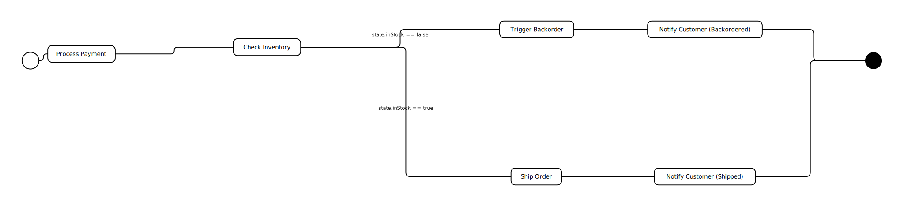

# E-commerce Order Fulfillment

This example demonstrates a typical e-commerce order fulfillment workflow. It shows how a business process can be modeled as a series of steps, with decisions that change the path of the workflow.

## Workflow Explained

The workflow starts when a customer places an order. Here's how it works:

1.  **Process Payment:** The first step is to process the customer's payment.

2.  **Check Inventory:** Once the payment is successful, the workflow checks if the ordered item is in stock. This is a crucial decision point.

3.  **If the item is in stock:**
    *   **Ship Order:** The order is sent to the warehouse for shipping.
    *   **Notify Customer (Shipped):** An email is sent to the customer to let them know their order has been shipped.

4.  **If the item is out of stock:**
    *   **Trigger Backorder:** The workflow triggers a backorder process in the inventory system.
    *   **Notify Customer (Backordered):** An email is sent to the customer to inform them about the backorder and provide an estimated shipping date.

5.  **End Order:** The workflow concludes after the appropriate notifications have been sent.

## Global State

To make this workflow dynamic, we use a few pieces of information that are available to all steps:

*   `orderId`: A unique identifier for the order.
*   `itemId`: The ID of the item that was ordered.
*   `inStock`: A simple `true` or `false` value that tells the workflow whether the item is available. The decision to ship or backorder is based on this value.