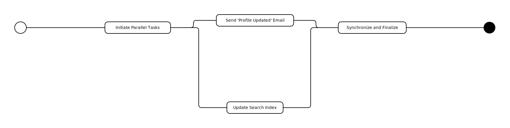

# Fork-Join Flow (Simulated)



This example demonstrates how to simulate a fork-join pattern for parallel execution. In a fork-join pattern, a main process splits into multiple parallel processes and then waits for all of them to complete before it continues.

## The Challenge of True Parallelism

`tiny-json-workflow` does not have a built-in mechanism to enforce a "join" (i.e., wait for multiple branches to complete). The execution of the workflow is handled by an external runner, which processes one step at a time.

## Simulating the Pattern

This workflow simulates a fork-join pattern by defining the structure of the parallel tasks. The actual orchestration of the join logic needs to be handled by the workflow runner.

Here's how the simulation works:

1.  **Fork:** A `fork` task initiates two parallel tasks (`update-search-index` and `send-email-notification`).

2.  **Parallel Tasks:** These two tasks can be executed in parallel by the workflow runner.

3.  **Join:** A `join-tasks` task is defined to synchronize the parallel branches. The workflow runner is responsible for ensuring that this task is only executed after both `update-search-index` and `send-email-notification` have completed.

This example provides the structure for a fork-join workflow, but the implementation of the parallel execution and synchronization logic is left to the developer of the workflow runner.

---

## Code Implementation: Start and Poll Pattern

While the JSON defines the *intent* of parallel execution, the actual implementation uses the **"Start and Poll"** pattern to handle long-running external tasks reliably.

You can generate this implementation using `tiny-json-workflow` with AI assistance (see `do_generate.json`), which produces a robust, resilient workflow script.

### How the Code Works

The logic in `play.ts` orchestrates the parallel execution statefully:

1.  **Fork & Start (Atomic Step):**
    The `InitiateAndStartTasks` step triggers multiple external tasks immediately.
    *   **Idempotency:** The external system call is designed to be idempotent. If the step is re-executed (e.g., due to a crash before saving), it won't duplicate the jobs.
    *   **State Tracking:** The tasks are marked as `running` in the workflow's persistent state.

2.  **Parallel Execution (External):**
    The external system (simulated in `play.ts`) runs the tasks. These could be real-world API calls, database jobs, or human approval processes.

3.  **Join via Polling:**
    The `SynchronizeAndFinalize` step acts as a checkpoint.
    *   It periodically polls the status of all running tasks.
    *   It uses `waitForMs` to pause execution without blocking resources, allowing the workflow to "sleep" and resume later.
    *   **Error Handling:** It captures failures (e.g., `failed` status) and persists error details in the state.

4.  **Finalization:**
    Only when all tasks are `completed` or `failed` does the workflow proceed to the final step.

### Key Features

*   **Resiliency:** The workflow can be stopped and resumed at any point. Task statuses are saved in the `DurableState`.
*   **Non-Blocking:** The "polling" mechanism releases the runner worker while waiting, scaling efficiently for long-running tasks.
*   **Separation of Concerns:** The workflow manages *control flow*, while the external system manages *execution*.

### Running the Example

```bash
bun run packages/examples/src/fork-join-flow/play.ts
```
