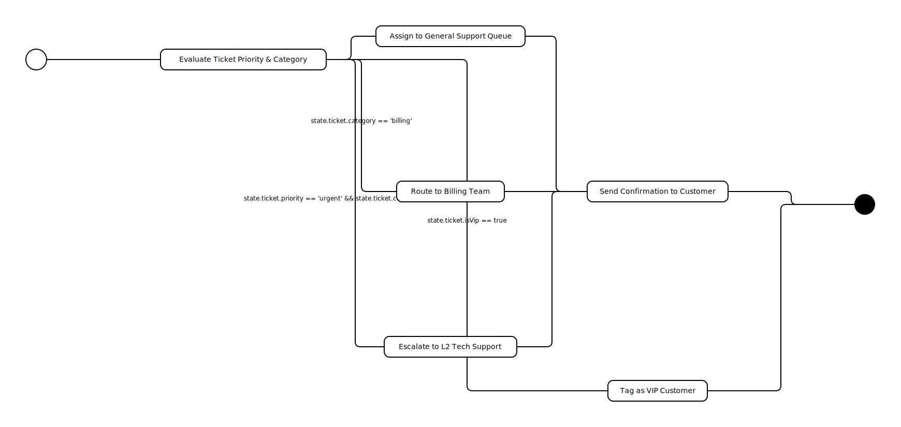

# Support Ticket Routing



This example demonstrates a conditional routing workflow for customer support tickets. It showcases how to implement decision logic and handle both simple and long-running tasks within a single workflow.

## The Challenge: Hybrid Workflows

Real-world workflows often require a mix of immediate logical decisions (routing) and long-running external processes (escalations that might take hours). Managing the state and reliability of such mixed workflows can be complex.

## Understanding the Routing Logic

This workflow simulates a support ticket system where the path is determined by ticket properties. The logic is defined in the JSON and implemented as follows:

1.  **Urgent & Technical:** Triggers a long-running L2 escalation process. This simulates handing off work to an external system and waiting for completion.
2.  **Billing:** Routes directly to the billing department (Immediate action).
3.  **VIP:** Adds a special VIP tag to the ticket (Immediate action).
4.  **General:** Assigns to the general support pool (Default path).

## Code Implementation: Start and Poll Pattern

This implementation uses `tiny-json-workflow` to seamlessly integrate decision-making with robust task execution.

You can generate this implementation using `tiny-json-workflow` with AI assistance (see `do_generate.json`), which produces a robust, resilient workflow script.

### How the Code Works

The logic in `play.ts` demonstrates several key patterns:

1.  **Decision Logic (Routing):**
    The `EvaluateTicket` step translates the JSON schema's conditional logic into TypeScript code. It inspects the `ticket` state (priority, category, VIP status) to determine the next step efficiently.

2.  **Long-Running Task (Urgent Escalation):**
    The `EscalateUrgent` step implements the **"Start and Poll"** pattern for tasks that aren't immediate.
    *   **Start:** It initiates an external "escalation job" via `withAction` (ensuring idempotency) and saves the Job ID.
    *   **Poll:** It enters a loop, checking the job status periodically.
    *   **Fresh Checks:** The status check is performed *directly* (without `withAction`) to ensure we always get the latest status from the external system.
    *   **Wait:** It uses `waitForMs` to suspend execution between checks, freeing up system resources.

3.  **Atomic Actions:**
    Simple steps like `RouteToBilling` or `AssignGeneral` are wrapped in `withAction`. This ensures **idempotency**: if the workflow crashes and restarts, these actions (like sending an email or updating a database) won't run twice if they already succeeded.

### Key Features

*   **Conditional Routing:** Dynamic path selection based on business data.
*   **Resiliency:** The polling mechanism allows the workflow to "sleep" for days if necessary while waiting for an external process, safe from system reboots.
*   **Type Safety:** The generated code uses TypeScript interfaces for the Ticket and State, ensuring compile-time safety for your business logic.

### Running the Example

```bash
bun run packages/examples/src/support-ticket-routing/play.ts
```
